<a id="top"></a>
# In the midst of Agile Methodology <a href="../README.md">&#8592; Home</a>

A short introduction about the agility and with a mix of advices, practices, return on experience... And always few basic takeaways.

A mix of theoretical and practical elements but the purpose to remain vivid and straightforward.

**<a href="#agile_1">1. Behind the scene** &#8595;</a><br>
**<a href="#agile_2">2. Play Agile** &#8595;</a><br>
**<a href="#agile_3">3. Do you speak Agile?** &#8595;</a><br>
- **<a href="#agile_3_1">3.1 Scrum Artefacts** &#8595;</a><br>
- **<a href="#agile_3_2">3.2 Scrum Ceremonies or Events or Rituals** &#8595;</a><br>
- **<a href="#agile_3_3">3.3 Sprint Cycle Illustration** &#8595;</a><br>

**<a href="#agile_4">4. Boards** &#8595;</a><br>

**<a href="#agile_5">5. Graphic facilitation** &#8595;</a><br>
- **<a href="#agile_5_1">5.1 How, Where and When?** &#8595;</a><br>
- **<a href="#agile_5_2">5.2 The Graphic facilitation explained by Graphic facilitation** &#8595;</a><br>
- **<a href="#agile_5_3">5.3 Be humble start step by step** &#8595;</a><br>
- **<a href="#agile_5_4">5.4 Let's do it together, pick up a form and do the try-it-yourself** &#8595;</a><br>
- **<a href="#agile_5_4">5.5 Want more?** &#8595;</a><br>


**<a href="#agile_6">6. Wireframing** &#8595;</a><br>
- **<a href="#agile_6_1">6.1 Online applications** &#8595;</a><br>
- **<a href="#agile_6_2">6.2 Softwares** &#8595;</a><br>
- **<a href="#agile_6_3">6.3 Spotlight on Sketch** &#8595;</a><br>
- **<a href="#agile_6_4">6.4 Some real work situations** &#8595;</a><br>

**<a href="#agile_7">7. Gherkin** &#8595;</a><br>
- **<a href="#agile_7_1">7.1 A gherkin feature for an API** &#8595;</a><br>
- **<a href="#agile_7_2">7.2 A gherkin feature for WordPress** &#8595;</a><br>

**<a href="#agile_8">8. Feedback on Agility, few key things to remember** &#8595;</a><br>
- **<a href="#agile_8_1">8.1 Manage interactions** &#8595;</a><br>
- **<a href="#agile_8_2">8.2 Achieve** &#8595;</a><br>
- **<a href="#agile_8_3">8.3 Learn** &#8595;</a><br>

**<a href="#agile_9">9. Culture hack and Mindset, a step forward in Digital Transformation** &#8595;</a><br>
- **<a href="#agile_9_1">9.1 How individually answer to the change ?** &#8595;</a><br>
- **<a href="#agile_9_2">9.2 Collectively practice the cultural hack** &#8595;</a><br>

**<a href="#agile_10">10. More resources** &#8595;</a><br>


<a id="agile_1"></a>
## 1. Behind the scene <a href="#top">&#8593;</a><br>

**Time is at Storytelling, in addition to language's elements, there are plenty of artefacts that promote and inseminate agile values in a team.**

This is the purpose of the list below. What does these heterogeneous elements reveal? It is important to vary and mix the modes of communication from visual to linguistic and even corporal. Why? Because we are as individuals both identical and singular and all these individuals make a team.

Unfortunately or fortunately, the relevance of a message can only be measured by its adoption and the effect it produces. It is therefore important to define some synthetic "mantra" which describe in a few words the objectives pursued or the shared values by the team.

**Create a narrative for infusing growth mindset traits in your team culture can accelerate transformation. Develop language (for example, "learn-it-all beats know-it-all") that you routinely use in meetings and key change situations.**

<a id="agile_2"></a>
## 2. Play Agile <a href="#top">&#8593;</a><br>
Let's gave the same short job description for project management from 2 different perspectives or mindsets, deliberately exaggerated.

**With a Waterfall perspective**

> My job is to make project management, with a stressed mindset, to deliver after a chaotic 9 months development process, a deprecated and not-so-user-tested product.

**With an Agile perspective**
> My job is to make project management by dealing with complexity and realities in uncertainty, with a playful mindset, thus delivering value with repeated short iterations each ended by a product demo and deliver by the end a product that I am proud of.

Ok, let's say that the truth is in between!

<a id="agile_3"></a>
## 3. Do you speak Agile?<a href="#top">&#8593;</a><br>

**Let's focus only on Agile methodology and like always we can not avoid tedious definitions about rituals, ceremonies that are commonly used in Scrum. We will give also some insights on Kanban.**

<a id="agile_3_1"></a>
### 3.1 Scrum Artefacts <a href="#top">&#8593;</a><br>

**(i) `Product Backlog`:**<br>
Product Backlog is the master list of work that needs to get done maintained by the product owner or product manager. This is a dynamic list of features, requirements, enhancements, and fixes that acts as the input for the sprint backlog. It is, essentially, the team's `To Do` list. The product backlog is constantly revisited, re-prioritized and maintained by the Product Owner because, as we learn more or as the market changes, items may no longer be relevant or problems may get solved in other ways.


**(ii) `Sprint Backlog`:**<br>

Sprint Backlog is the list of items, user stories, or bug fixes, selected by the development team for implementation in the current sprint cycle. Before each sprint, in the sprint planning meeting (which we'll discuss later in the article) the team chooses which items it will work on for the sprint from the product backlog. A sprint backlog may be flexible and can evolve during a sprint. However, the fundamental sprint goal – what the team wants to achieve from the current sprint – cannot be compromised.


**(iii) `Increment (or Sprint Goal)`:**<br>
Increment (or Sprint Goal) is the usable end-product from a sprint. Most of time, there is a real demonstration of the `increment` during the end-of-sprint demo, where the team shows what was completed in the sprint. 


You may not hear the word "increment" out in the world, as it's often referred to as the team's definition of `Done`, a milestone, the sprint goal, or even a full version or a shipped epic. It just depends on how your teams defines `Done` and how you define your sprint goals. For example, some teams choose to release something to their customers at the end of every sprint. So their definition of `Done` would be `shipped`. However, this may not be realistic of other types of teams. 


Say you work on a server-based product that can only ship to your customers every quarter. You may still choose to work in 2-week sprints, but your definition of `Done` may be finishing part of a larger version that you plan to ship together. But of course, the longer it takes to release software, the higher the risk that software will miss the mark.


<a id="agile_3_2"></a>
### 3.2 Scrum Ceremonies or Events or Rituals <a href="#top">&#8593;</a><br>

Below is a list of all the key ceremonies a scrum team might partake in:

**(i) `Organize the backlog`:**<br>
Sometimes known as backlog grooming, this event is the responsibility of the product owner. The product owner's main jobs are to drive the product towards its product vision and have a constant pulse on the market and the customer. Therefore, he/she maintains this list using feedback from users and the development team to help prioritize and keep the list clean and ready to be worked on at any given time. You can read more about maintaining a healthy backlog here.

**(ii) `Sprint planning`:**<br>
The work to be performed (scope) during the current sprint is planned during this meeting by the entire development team. This meeting is led by the scrum master and is where the team decides on the sprint goal. Specific use stories are then added to the sprint from the product backlog.  These stories always align with the goal and are also agreed upon by the scrum team to be feasible to implement during the sprint.

At the end of the planning meeting, every scrum member needs to be clear on what can be delivered in the sprint and how the increment can be delivered.

**(iii) `Sprint`:**<br>

- `Sprint`: A sprint is a short, time-boxed period when a scrum team works to complete a set amount of work. Sprints are at the very heart of scrum and agile methodologies, and getting sprints right will help your agile team ship better software with fewer headaches. It makes the project more manageable. Let's say it takes between 2 or 3 weeks.

A `sprint` is the actual time period when the scrum team works together to finish an increment. Two weeks is a pretty typical length for a `sprint`, though some teams find a week to be easier to scope or a month to be easier to deliver a valuable increment. Dave West, from Scrum.org advises that the more complex the work and the more unknowns, the shorter the `sprint` should be. But it's really up to your team, and you shouldn't be afraid to change it if it's not working! During this period, the scope can be re-negotiated between the product owner and the development team if necessary. This forms the crux of the empirical nature of scrum.


All the events — from planning to retrospective — happen during the sprint. Once a certain time interval for a `sprint` is established, it has to remain consistent throughout the development period. This helps the team learn from past experiences and apply that insight to future sprints.

**(iv) `Daily Scrum` or `Stand Up`:**<br>
This is a daily super-short meeting that happens at the same time (usually mornings) and place to keep it simple. Many teams try to complete the meeting in 15 minutes, but that's just a guideline. This meeting is also called a `daily stand-up` emphasizing that it needs to be a quick one. The goal of the daily scrum is for everyone on the team to be on the same page, aligned with the sprint goal, and to get a plan out for the next 24 hours.

The stand up is the time to voice any concerns you have with meeting the sprint goal or any blockers. 

A common way to conduct a stand up is for every team member to answers 3 questions in the context of achieving the sprint goal:

1. What did I do yesterday?
2. What do I plan to do today?
3. Are there any obstacles?

However, we've seen the meeting quickly turn into people reading from their calendars from yesterday and for the next day. The theory behind the stand up is that it keep distracting chatter to a daily meeting, so the team can focus on the work for the rest of the day.  So if it turns into a daily calendar read-out, don't be afraid to change it up and get creative.

**(v) `Sprint review`:**<br>
At the end of the sprint, the team gets together for an informal session to view a demo of, or inspect, the increment. The development team showcases the backlog items that are now `Done` to `stakeholders` and teammates for feedback. The `product owner` can decide whether or not to release the increment, although in most cases the increment is released.

This review meeting is also when the product owner reworks the product backlog based on the current sprint, which can feed into the next sprint planning session. For a one-month sprint, consider time-boxing your sprint review to a maximum of four hours.

**(vi) `Sprint retrospective`:**<br>The retrospective is where the team comes together to document and discuss what worked and what didn't work in a sprint, a project, people or relationships, tools, or even for certain ceremonies. The idea is to create a place where the team can focus on what went well and what needs to be improved for the next time, and less about what went wrong.

<a id="agile_3_3"></a>
### 3.3 Sprint Cycle Illustration <a href="#top">&#8593;</a><br>
A great view of the sprint in Circle which shows the nesting of all the interactions.


**Sprint Cycle**<br>
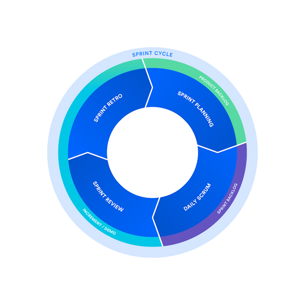<br>
*<code>Copyright &copy; Atlassian</code>*


### 3.3 One word on Kanban <a href="#top">&#8593;</a><br>
Kanban is a popular framework used to implement agile software development. It requires real-time communication of capacity and full transparency of work. Work items are represented visually on a kanban board, allowing team members to see the state of every piece of work at any time.


*Source: <a href="https://www.atlassian.com/agile" target="_blank">https://www.atlassian.com/agile</a>*

<a id="agile_3_4"></a>
### 3.4 Tools to manage projects <a href="#top">&#8593;</a><br>

Even, if you do not work with a geographically distributed team, having a tool shareable, accessible anywhere, is a requirement. Remember that most of what the team must do, has be recorded properly and synthetically in tickets.

**Using one of these tools, with Slack in addition, you should be prepared for any eventuality. We just present the most popular tools on the actual market but a very tedious and exhausted benchmark should be made. It is not only to answer the question: Do I take a Free or a Paid tool?**

- Asana: <a href="https://asana.com/" target="_blank">https://asana.com/</a>

- Jira: <a href="https://www.atlassian.com/software/jira" target="_blank">https://www.atlassian.com/software/jira</a>

- Redmine: <a href="https://www.redmine.org/" target="_blank">https://www.redmine.org/</a>

- Trello: <a href="https://trello.com/" target="_blank">https://trello.com/</a>

<a id="agile_3_5"></a>
### 3.5 Few pictures to remember <a href="#top">&#8593;</a><br>

**Here is some drawings that may help out to defispecifies the outlines these methodologies.**

**(i) Lean & MVP**<br>

**A drawing that really captures the essence of iterative & incremental development, lean startup, MVP (minimum viable product)**<br><br>
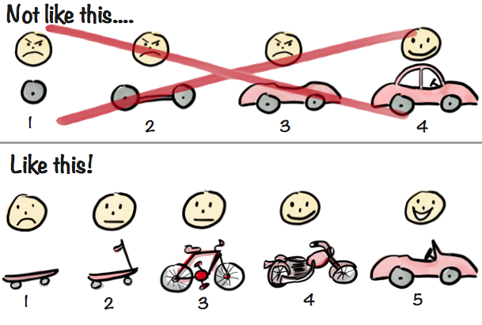

*Source: <a href="https://blog.crisp.se/2016/01/25/henrikkniberg/making-sense-of-mvp" target="_blank">https://blog.crisp.se/2016/01/25/henrikkniberg/making-sense-of-mvp</a>*

**The lean startup: the build-measure-learn feedback loop.**<br>
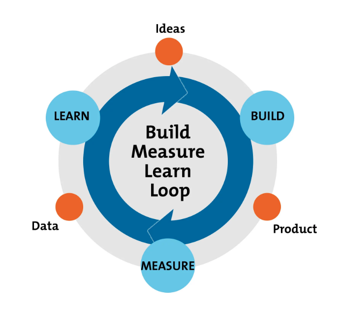<br>
*<code>Copyright &copy; mindtools.com</code>*


**(ii) Sprint Steps in Scrum**<br>
These pictures can help out to understand the Sprint's steps in the Scrum method.

**The sequence of steps of a Sprint in the Scrum method**<br>
<br>
*<code>Copyright &copy; valnaos.com</code>*


**A Sprint presentation more digital application oriented**
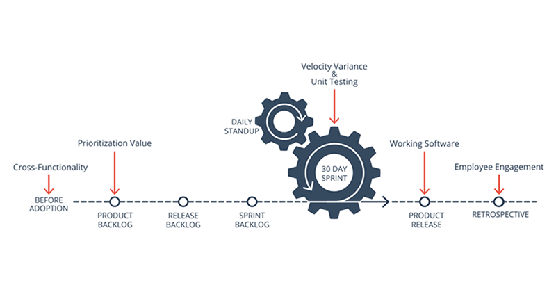<br>
*<code>Copyright &copy; axosoft.com</code>*


<a id="agile_4"></a>
## 4. Boards <a href="#top">&#8593;</a><br>
You can use boards, where at a glance, you can visualize the progress of any project. You can find plentuy of models on the web to get columns names and define your own logic that fit to your needs.


**A board can be a quite sophisticated and organised that reflects your workflow**
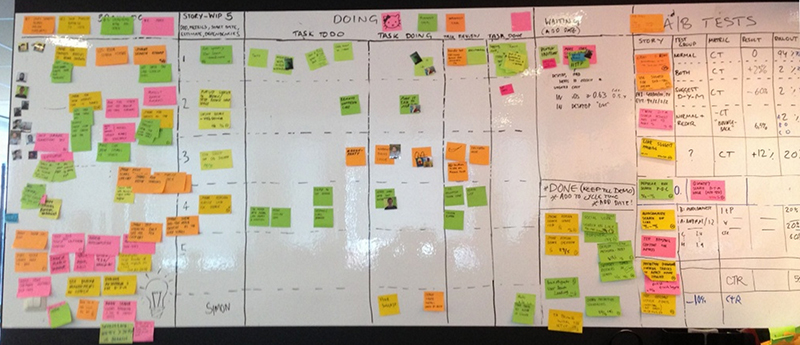<br>
*<code>Copyright &copy; Spotify Agile Board pinterest.com</code>*


**A board with on the right events coming up like Retro, Demo...etc.**
<br>
*<code>Copyright &copy; productcoalition.com</code>*


 Always try to associate Form and Substance. Here is a example of Virtuous Circle for Scrum Values.

**Or you can use Board as Values Reminder**
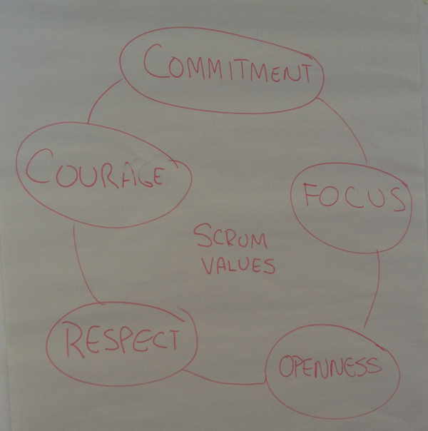<br>
*<code>Copyright &copy; FMM</code>*


<a id="agile_5"></a>
## 5. Graphic facilitation <a href="#top">&#8593;</a><br>
One of my favourite occupation that goes pretty well with the previous point. It goes on paper-board, scrapbook...etc. Very easy to initiate, do not think you cannot draw.

**You can use it in meetings, training, notes taking. The visual content thus created becomes itself the support of the discussion or the formation. Nothing is lost, nothing is created: everything is transformed**

<a id="agile_5_1"></a>
### 5.1 How, Where and When? <a href="#top">&#8593;</a><br>

**During a meeting as speech facilitator**<br>
*Help you out to position yourself in a retro for instance*
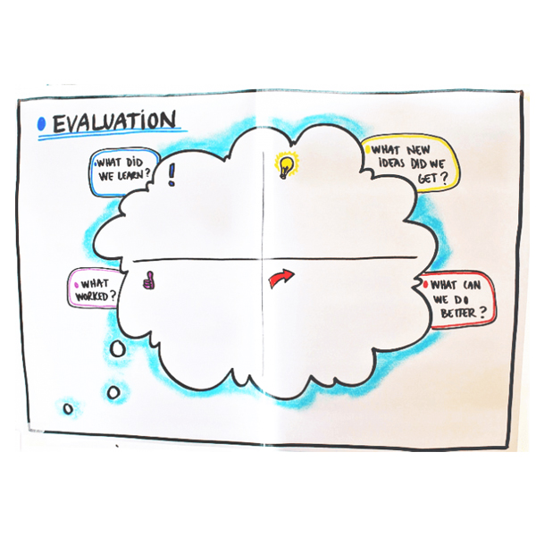<br>
*<code>Copyright &copy; uxstudioteam.com</code>*


**Advantages of drawing over other tools, more "plastic"**

Why is there advantages of storyboarding before development on the other tools for instance tool like PPT ?<br>

**Here is a beginning of answer: reflection & thoughts are most of time non-linear. Drawing is a key element for storytelling. Drawing combines more easily errors, shortcuts, reversals that are the reflection and creativity essentials.**<br>

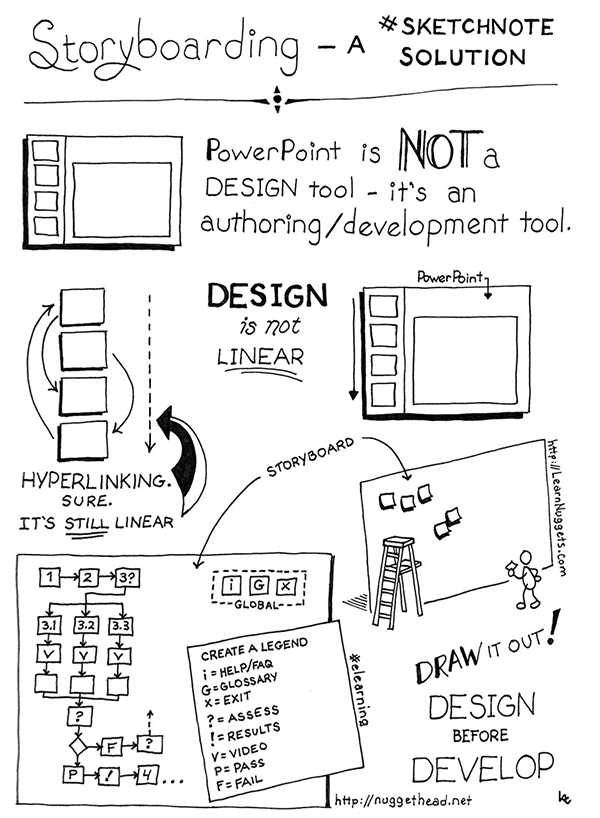<br>
*<code>Copyright &copy; Creative Market / nuggethead.net</code>*

<a id="agile_5_2"></a>
### 5.2 The Graphic facilitation explained by Graphic facilitation <a href="#top">&#8593;</a><br>

**The whole concept in one picture**<br>
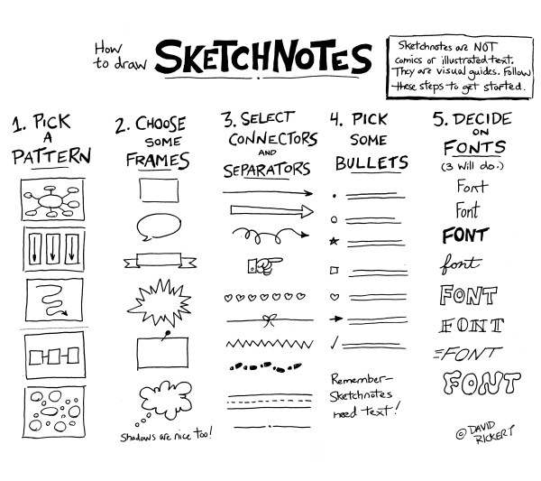<br>
*<code>Copyright &copy; davidrickert.com</code>*

<a id="agile_5_3"></a>
### 5.3 Be humble start step by step <a href="#top">&#8593;</a><br>

You have fundamentals form that can help you out in order to project your ideas on paper support.

**Play with fundamentals**<br><br>
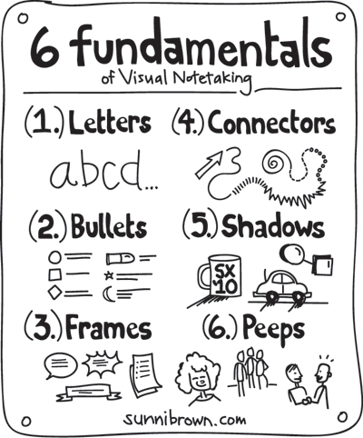<br>
*<code>Copyright &copy; Creative Market</code>*

**Then start using basics elements**<br>
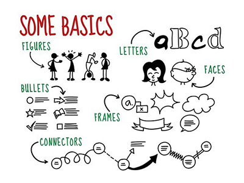<br>
*<code>Copyright &copy; pinterest.com</code>*


<a id="agile_5_4"></a>
### 5.4 Let's do it together, pick up a form and do the try-it-yourself <a href="#top">&#8593;</a><br>

**Game 1: Keep in form**<br>
*Draw basic forms to start with graphic facilitation*<br>
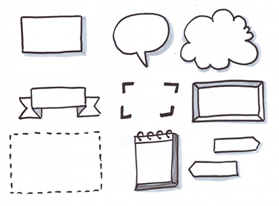<br>
*<code>Copyright &copy; uxstudioteam.com</code>*


**Game 2: Oh, please, Draw Me A Sheep!  No, I will draw a banner!**<br>
*Add some banner to your board or your notes*<br>
<br>
*<code>Copyright &copy; pinterest.ca</code>*


**Game 3: The Roy Lichtenstein Contest**<br>
*Let's play with words and emphasize intentions with the fonts like in Comic Books*<br>
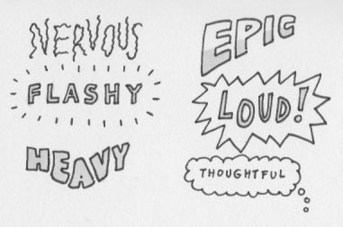<br>
*<code>Copyright &copy; uxmastery.com</code>*


<a id="agile_5_5"></a>
### 5.5 Want more? <a href="#top">&#8593;</a><br>

- See Your Ideas: Think With Ink<br><a href="http://www.lizardbrainsolutions.com/" target="_blank">http://www.lizardbrainsolutions.com/think-with-ink</a>

- How To Hold Better Meetings With The Help Of Graphic Facilitation<br><a href="https://uxstudioteam.com/ux-blog/graphic-facilitation/" target="_blank">https://uxstudioteam.com/ux-blog/graphic-facilitation/</a>

<a id="agile_6"></a>
## 6. Wireframing <a href="#top">&#8593;</a><br>
A very helpful way of presenting user stories to anyone: developers, PO, stakeholders. It is a time saver as you are trying to bring to life a user experience.

There is a lot a SAAS or online tools or you can pickup one of the major tool below. The list is far from being an exhaustive list! As there is a tool that

<a id="agile_6_1"></a>
### 6.1 Online applications <a href="#top">&#8593;</a><br>


- Ninjamock<br><a href="https://ninjamock.com/" target="_blank">https://ninjamock.com/</a>

- invisionapp<br><a href="https://invisionapp.com/" target="_blank">https://invisionapp.com/</a>

- Mockflow<br><a href="https://mockflow.com/" target="_blank">https://mockflow.com/</a>

- Moqups<br><a href="https://moqups.com/" target="_blank">https://moqups.com/</a>

- Wireframe.cc<br><a href="https://wireframe.cc/" target="_blank">https://wireframe.cc/</a>

*Just type "online wireframe and mockup tool" in Google and you can make your choice!*

<a id="agile_6_2"></a>
### 6.2 Softwares <a href="#top">&#8593;</a><br>
These software are sometime pretty sophisticated and have a learning curb it is like video editing. Avoid the multiple purpose tool.
My favourite Balsamiq even though it is is in Flash.


- Balsamiq<br><a href="http://www.balsamiq.com/" target="_blank">http://www.balsamiq.com/</a>

- Pencil Project<br><a href="http://pencil.evolus.vn/" target="_blank">http://pencil.evolus.vn/</a>

- OmniGraffle<br><a href="http://www.omnigroup.com/" target="_blank">http://www.omnigroup.com/</a>

- Axure<br><a href="http://www.axure.com/" target="_blank">http://www.axure.com/sample-prototypes</a>


- More on Mockup (French)<br><a href="http://flaven.fr/?s=mockup" target="_blank">http://flaven.fr/?s=mockup</a>

<a id="agile_6_3"></a>
### 6.3 Spotlight on Sketch <a href="#top">&#8593;</a><br>

Sketch is a rare gem and combined with Craft, a cleverly plugin developed by Invisionapp, it become almost a killer application.

The combination is here to promote the horizontal integration of their platform with the two most popular software for Sketch and Photoshop screen design. It is certain that what is emerging is the winning combination for the creation of applications including: Sketch, Craft, Invisionapp.

**If, in this combination, you add a tool like Jira in project management, then you will have in your hands what is currently best in the creation and the most agile management possible.**

My favourite element in the Sketch software is the ability to "clone" content and/or "plug" external sources to give more credibility to your models, to make them more attractive to all: PO, Stakeholders, Graphic Designers, Developers etc.

**The mockup of a screen based on fake json made with Sketch and Craft**<br>
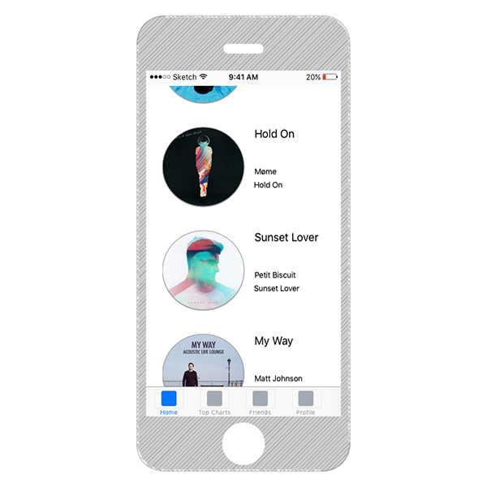<br>
*<code>Copyright &copy; flaven.fr</code>*


Source: How-to use Sketch and Craft (French)<br><a href="http://flaven.fr/2017/05/sketch-craft-utiliser-la-combinaison-sketch-et-craft-pour-la-conception-dapplications-android-et-ios/" target="_blank">http://flaven.fr/2017/05/sketch-craft-utiliser-la-combinaison-sketch-et-craft-pour-la-conception-dapplications-android-et-ios/</a>

<a id="agile_6_4"></a>
### 6.4 Some real work situations <a href="#top">&#8593;</a><br>
Some images from real experiences from website mock-up or wp plugin mock-up.

**Elements for Wireframing with Balsamiq**<br>
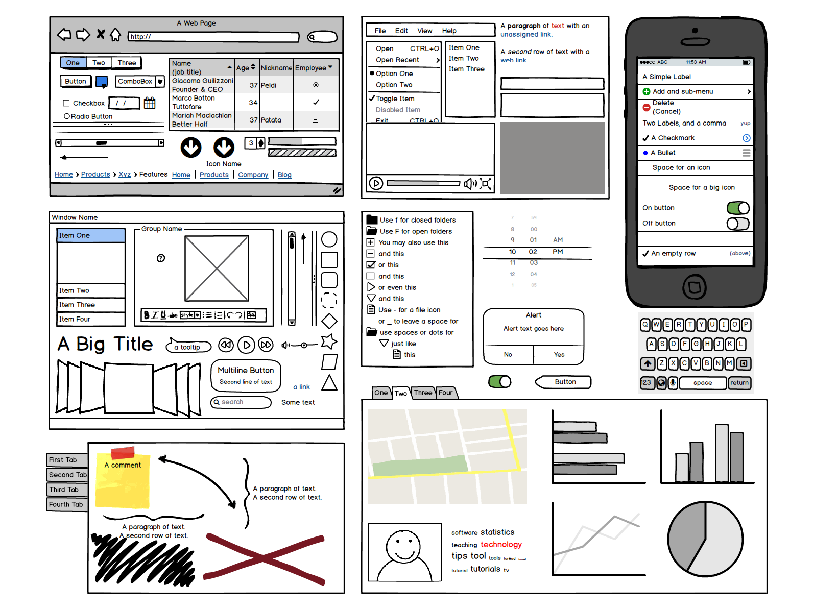<br>
*<code>Copyright &copy; medium.com/@pavithraa</code>*


**All elements to illustrate Funnel scenario or an Epic, that aggregate User Storie**<br>
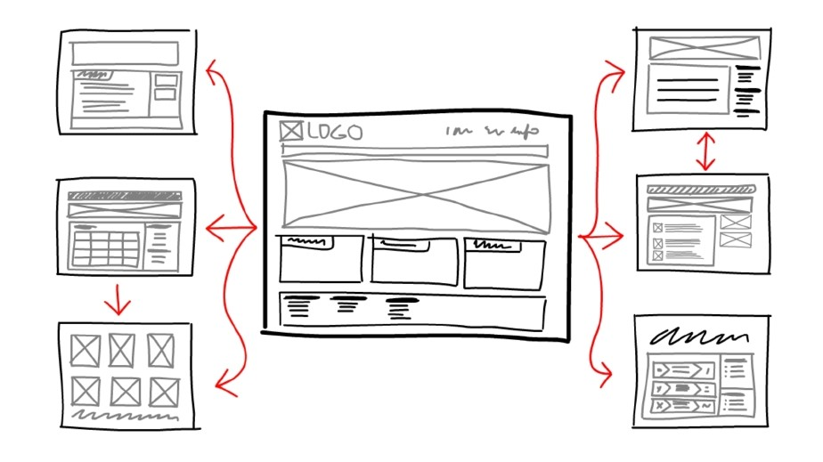<br>
*<code>Copyright &copy; oursky.com</code>*


**Designed before developed : a WP plugin designed first with Balsamiq**<br>

*This plugin really existed. It was part of end-to-end exercise for crafting a WordPress plug-in from mock-up to field-name description, going through coding and even including a gherkin feature in order to offer the best user experience. Check <a href="https://github.com/bflaven/PluginWordpressForFun/tree/master/check_news" target="_blank">https://github.com/bflaven/PluginWordpressForFun/tree/master/check_news</a>*

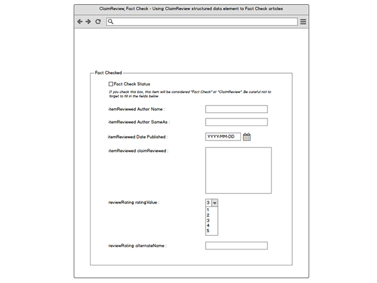<br>
*<code>Copyright &copy; FMM</code>*


**Input: The screen functionally designed with Balsamiq**<br>
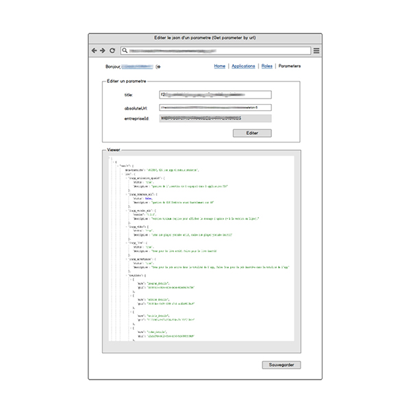<br>
*<code>Copyright &copy; FMM</code>*


**Output: The same screen developed in Symfony**<br>

*This work can be done even though the API web services needed to operate this screen are not ready. It is a functional milestone not a technical one!*

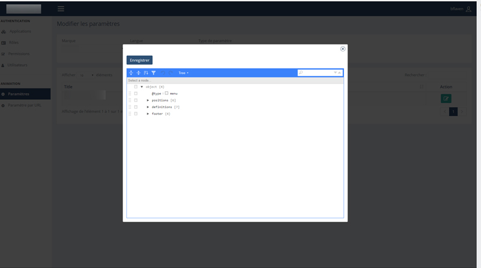<br>
*<code>Copyright &copy; FMM</code>*


<a id="agile_7"></a>
## 7. Gherkin <a href="#top">&#8593;</a><br>

The gherkin can be used for headless or browser functional testing. For instance, a successful combination can be made with Browserstack, Symfony and Mink to make functional testing.

**Gherkin is also a pretty good way to avoid blurred description in application features or to describe user story even though the features will not be run. It can be used in WordPress or for an API.**

An excerpt from Dan North's blog about the importance of behavior-driven development (BDD).

> It has evolved out of established agile practices and is designed to make them more accessible and effective for teams new to agile software delivery. Over time, BDD has grown to encompass the wider picture of agile analysis and automated acceptance testing.

<a id="agile_7_1"></a>
### 7.1 A gherkin feature for an API <a href="#top">&#8593;</a><br>
These are features written for an existing API made with Node @<a href="https://github.com/bflaven/a-quick-journey-through-api-testing">https://github.com/bflaven/a-quick-journey-through-api-testing</a>


"From Node Application to Postman best practices through Gherkin features".<br>
The book can be found on Amazon at this address: <a href="https://www.amazon.fr/dp/B07MH81L1X/" rel="nofollow">A quick journey through API Testing. From Node Application to Postman best practices through Gherkin features (English Edition)</a>


```gherkin
Feature: Testing countries REST API FlagApi

  Background: 
  * url demoBaseUrl
  
  # 01_testing_get_the_country_flag
  Feature: Flagapi Searching by countries by flag
  As a user, I want to search in Flagapi, so that I can find flag for each country.
  
  Scenario: Get the country by flag
    Given I have started Flagapi
     When I send and accept JSON
      And I send a GET request to "/api/v2/flag/" with the value "<guid>"
     Then the response status should be "200"
      And the JSON response should contain the field "flag"
      And the JSON response should have "$..flag[0]" with the value "<guid>"
      And the JSON response should include "<name>"
      And the JSON response should include "<url>"
  
    Examples: Flags
      | guid | name        | url                                 | 
      | AF   | Afghanistan | http://localhost:3000/images/af.png | 
      | XX   | CountryName | FlagUrl                             | 
  
  # 02_testing_get_the_country_capital
  Feature: Flagapi Searching by countries by capital
  As a user, I want to search in Flagapi, so that I can find the capital for each country.
  
  Scenario: Get the country by capital
    Given I have started Flagapi
     When I send and accept JSON
      And I send a GET request to "/api/v2/capital/" with the value "<guid>"
     Then the response status should be "200"
      And the JSON response should contain the field "capital"
      And the JSON response should have "$..capital" with the value "<guid>"
  
    Examples: Capitals
      | guid        | 
      | Kabul       | 
      | CapitalName | 
  
  # 03_testing_get_the_country_language
  Feature: Flagapi Searching by countries by language
  As a user, I want to search in Flagapi, so that I can find the language for each country.
  
  Scenario: Get the country by language
    Given I have started Flagapi
     When I send and accept JSON
      And I send a GET request to "/api/v2/language/" with the value "<guid>"
     Then the response status should be "200"
      And the JSON response should contain the field "nativeLanguage"
      And the JSON response should have "$..nativeLanguage" with the value "<guid>"
      And the JSON response should have "$..nativeLanguage" with a length of 3
  
    Examples: Languages
      | guid | 
      | spa  | 
      | hye  | 
  
  # 04_testing_get_the_country_tld
  Feature: Flagapi Searching by countries by tld
  As a user, I want to search in Flagapi, so that I can find the Top-level domain (tld) for each country.
  
  Scenario: Get the country by tld
    Given I have started Flagapi
     When I send and accept JSON
      And I send a GET request to "/api/v2/tld/" with the value "<guid>"
     Then the response status should be "200"
      And the JSON response should contain the field "tld"
      And the JSON response should have "$..tld" as a string and not empty
      And the JSON response should have "$..tld" with a length of 3
      And the JSON response should have "$..tld" with the value "<guid>"
  
    Examples: Top-level domains
      | guid | 
      | .ar  | 
      | .bo  | 
  
  # 05_testing_get_the_country_area
  Feature: Flagapi Searching by countries by area
  As a user, I want to search in Flagapi, so that I can find the area for each country.
  
  Scenario: Get the country by area
    Given I have started Flagapi
     When I send and accept JSON
      And I send a GET request to "/api/v2/area/" with the value "<guid>"
     Then the response status should be "200"
      And the JSON response should contain the field "area"
      And the JSON response should have "$..area" as a string and not empty
      And the JSON response should have "$..area" with the value "<guid>"
  
    Examples: Top-level domains
      | guid     | 
      | 17098242 | 
  
  # 06_testing_get_the_country_borders
  Feature: Flagapi Searching by countries by borders
  As a user, I want to search in Flagapi, so that I can find the area for each country.
  
  Scenario: Get the country by area
    Given I have started Flagapi
     When I send and accept JSON
      And I send a GET request to "/api/v2/area/" with the value "<guid>"
     Then the response status should be "200"
      And the JSON response should contain the field "area"
      And the JSON response should have "$..area" with the value "<guid>"
  
    Examples: Top-level domains
      | guid     | 
      | 17098242 | 
```

<a id="agile_7_2"></a>
### 7.2 A gherkin feature for WordPress <a href="#top">&#8593;</a><br>
This is also the one used for the WP plugin on Fact Checking.

```gherkin
Feature: WordPress ClaimReview Article
WordPress post should be easy to convert into ClaimReview post

  Background: 
  Scenario Outline:
    Given WordPress is installed at <site_url>
  
    Examples: 
  
      | site_url | http://superfaker.com/ | 
  
  Scenario: Saving blogname
  Scenario Outline:
    Given I go to menu item "Settings > General"
     When I fill in "blogname" with "<site_title>"
      And I press "submit"
      And I should see "Settings saved."
      And I am on the homepage
     Then I should see "<site_title>" in the "h1 a" element
  
    Examples: 
  
      | site_title | Yaya's Guide To Super Truth | 
  
  Scenario: Saving blogdescription
  Scenario Outline:
    Given I go to menu item "Settings > General"
     When I fill in "blogdescription" with "<site_description>"
      And I press "submit"
      And I should see "Settings saved."
      And I am on the homepage
     Then I should see "<site_description>" in the ".site-description" element
  
    Examples: 
  
      | site_description | What Everybody Else Does When It Comes To Truthiness And What You Should Do Different | 
  
  Scenario: Converting a post into ClaimReview post
  Scenario Outline:
    Given I am logged in as "admin"
      And I am on admin dashboard
     When I follow "Add New" within "#menu-posts"
     Then I should see "Add New Post"
     When I fill in "title" with "<title>"    
      And I fill in "content" with "<content>"
  # Fact Checked
     Then I should see "Fact Check"
     When I check the "Fact Checked Status" with "<status>"
     Then I should see "Fact Check Details"
      And I fill in "itemReviewed Author Name" with "<itemReviewed_author_name>"
      And I fill in "itemReviewed Author SameAs" with "<itemReviewed_author_sameAs>"
      And I fill in "itemReviewed Date Published" with "<itemReviewed_datePublished>"
      And I fill in "itemReviewed claimReviewed" with "<itemReviewed_claimReviewed>"
      And I fill in "reviewRating ratingValue" with "<reviewRating_ratingValue>"
      And I fill in "reviewRating alternateName" with "<reviewRating_alternateName>"
```


More links about Gherkin and Behat can be found in this article: <a href="http://flaven.fr/2016/09/bdd-behat-gherkin-introduction-au-behavior-driven-development-avec-behat-et-mink/" target="_blank">http://flaven.fr/2016/09/bdd-behat-gherkin-introduction-au-behavior-driven-development-avec-behat-et-mink/</a>

<a id="agile_8"></a>
## 8. Feedback on Agility, few key things to remember <a href="#top">&#8593;</a><br>

**This is not again a full lesson on Agility or on Scrum but just few key elements really experimented at FMM throughout the Digital Transformation Process that have imply a move from Waterfall to Agile. Here is few agile practices on 3 concrete aspects on change management**

<a id="agile_8_1"></a>
### 8.1 Manage interactions <a href="#top">&#8593;</a><br>

**(i) Search of the essential**<br>
Listen, listen to each other, and ask themselves questions about your work's impact. **Give yourself the right not to perform a task that adds nothing in terms of value or effectiveness or whose cost time is greater than the expected profit.**

**(ii) Being emotionally close to your team**<br>
Distance is not a problem if you are emotionally close to your team. The important thing is to communicate well and to follow up emotions/needs of the team. **The subjective impression of the project is in itself an objective indicator of the health of the project.**

**(iii) I will be your worst nightmare**<br>
In case of conflict between 2 teams: how to defuse confrontation? A serious game can be made: Have the worst situation described to two opposing teams. The exchange must be done in a CNV (Non-violent Communication) spirit

<a id="agile_8_2"></a>
### 8.2 Achieve <a href="#top">&#8593;</a><br>

**(i) Deliver what is ready**<br>
How long have completed features been waiting to be put into production? The objective is to discover the prioritization by the value and to favour the finished work. Never postpone a product delivery, this is the reason why CI (Continuous Integration) exists!

**It highlights the importance of "Lead Time"**<br>
The "Lead Time" is actually the time that elapses between the beginning of a process and its end. It corresponds for example, the time that will take to a development team to deliver a new feature on an application.

**It is a very good metric on organization efficiency for a team. This aspect can be improved by numerous optimization searches in order to respond as quickly as possible to external or internal requests e.g pizzeria story.**

<a id="agile_8_3"></a>
### 8.3 Learn <a href="#top">&#8593;</a><br>

**(i) Save time for learning**<br>
In Lean never exceed 80% of resource use. Why not do the same and keep 20% of the time to learn and improve? With Katas, Dojos, code experiments or products? Constantly improve the team, the products and oneself, while not "overuse" the "resources" and thus improving the flow e.g Zambia training.

**(ii) Set a goal**<br>
Agility rhymes with simplicity but simple does not want with simplistic!
**A simple solution is not a simplistic solution. A simple and well-designed solution will be easy to evolve and maintain.** The target remains effectiveness e.g Cockpit.

**(iii) Work on a single metric**<br>
View and work on one indicator at a time. Identify a success indicator adapted to your project and its stage of progress. Change it when you reach your goal or as your project evolves. **This allows the entire team to make the right decisions, join forces to achieve the same goal and measure the impact of their efforts.** The objective is to focus on what is really important today e.g Image vs Performance in BO2.

<a id="agile_9"></a>
## 9. Culture hack and Mindset, a step forward in Digital Transformation <a href="#top">&#8593;</a><br>

**A very quick introduction to the concepts Growth Mindset vs Fixed Mindset to accelerate digital transformation.**

Different mindsets can trigger vastly divergent responses in two individuals to the same change situation. Threat or reward? Fight or flight? Just consider skilled and competent people facing a move out of their comfort zones.

The implicit question behind this question is how mindsets invisibly shape responses to change ? Imagine that all of us are a mixed of Growth Mindset and Fixed Mindset.

<a id="agile_9_1"></a>
### 9.1 How individually answer to the change ? <a href="#top">&#8593;</a><br>

Few practical advices, full of common sense, to individually behave towards changes.

- **Adopt new language:**"learn fast" rather than "fail fast". Instead of thinking that you have "failed" consider that you have "not yet" mastered the required skills.
- **Role-model learning and vulnerability:** People realize "it's OK not to know, but it's not OK not to learn. "learn-it-all beats know-it-all"

- **Confess one's ignorance:** You must combat perfectionism (a fixed mindset trait), where workers often fear appearing weak by low mastery of a skill.  The reward systems must recognize learning, not just performance.

- **No fear of failure:** It is a fixed mindset trait. It is failure that gives you the proper perspective on success.

<a id="agile_9_2"></a>
### 9.2 Collectively practice the cultural hack <a href="#top">&#8593;</a><br>
As a group, culture hack are opportunities to foster a culture where teams can lean into transformation together and experiment team-working.

The cultural hack has L.I.V.E characteristics.

- **L for Low-effort:** The hack should be easy to execute. It should take less than 48 hours to design and execute a hack. If your hack requires more than 10 people and three months to carry out, it's not a hack. But be sure to do not no confuse low effort with low courage.

- **I for Immediate:** It has to be made in 24 ou 48 hours not in 3 months. Think about the correlation between lead-time, impact and efficiency.

- **V for Visible:** The change should be visible to everyone in a meeting room (Boards), say, or everyone copied on an email.

- **E for Emotional:** The hack should incite a visceral reaction. Change is primarily an emotional process, not an analytical one, so the most efficient way to promote it is by using feelings, not facts.

<a id="agile_10"></a>
## 10. More resources <a href="#top">&#8593;</a>

- Management of uncertainty in agile projects<br><a href="https://managedagile.com/management-of-uncertainty-in-agile-projects/" target="_blank">https://managedagile.com/management-of-uncertainty-in-agile-projects/</a>


- Agile, Scrum, Méthodologie – Un tour d'horizon rapide sur la méthode agile (french)<br><a href="http://flaven.fr/2013/03/agile-scrum-methodologie-un-tour-dhorizon-rapide-sur-la-methode-agile/" target="_blank">http://flaven.fr/2013/03/agile-scrum-methodologie-un-tour-dhorizon-rapide-sur-la-methode-agile/</a>


- Feedback Loops and Measurement<br><a href="https://alankent.me/2014/02/15/feedback-loops-and-measurement/" target="_blank">https://alankent.me/2014/02/15/feedback-loops-and-measurement/</a>


- The Dual-Track Agile UX Process at Dell EMC<br><a href="https://www.slideshare.net/uxpin/the-dualtrack-agile-ux-process-at-dell-emc" target="_blank">https://www.slideshare.net/uxpin/the-dualtrack-agile-ux-process-at-dell-emc</a>


- The Build-Measure-Learn Feedback Loop<br><a href="https://www.mindtools.com/pages/article/build-measure-learn.htm" target="_blank">https://www.mindtools.com/pages/article/build-measure-learn.htm</a>

- What is scrum?<br><a href="https://www.scrum.org/resources/what-is-scrum" target="_blank">https://www.scrum.org/resources/what-is-scrum</a>

- Four agile ceremonies, demystified<br><a href="https://www.atlassian.com/agile/scrum/ceremonies" target="_blank">https://www.atlassian.com/agile/scrum/ceremonies</a>


- 15 Free Agile Project Management Tools for Your Scrum Team<br><a href="https://www.daxx.com/blog/development-team/free-agile-project-management-tools-for-your-scrum" target="_blank">https://www.daxx.com/blog/development-team/free-agile-project-management-tools-for-your-scrum</a>


