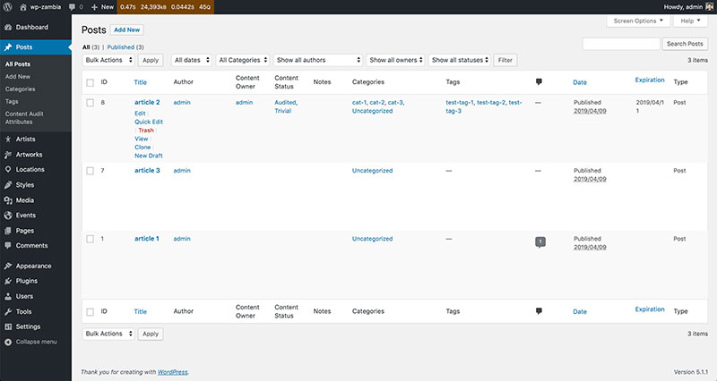
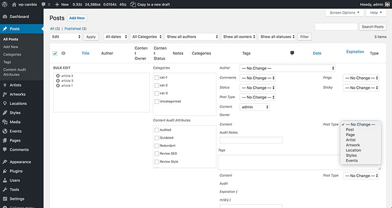
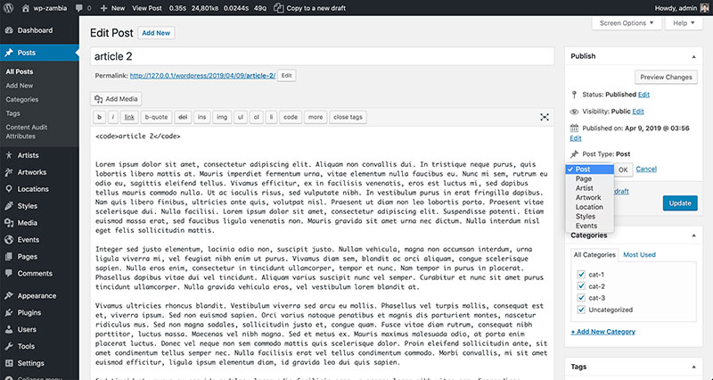

<a id="top"></a>
# Editorial it matters! <a href="../README.md">&#8592; Home</a>

**<a href="#editorial_1">1. Define a content strategy &#8595;</a>**<br>
**<a href="#editorial_1_1">1.1 Evaluate &#8595;</a>**<br>
**<a href="#editorial_1_2">1.2 Analyse &#8595;</a>**<br>
**<a href="#editorial_1_3">1.3 Structure &#8595;</a>**<br>
**<a href="#editorial_1_4">1.4 Fix &#8595;</a>**<br>
**<a href="#editorial_1_5">1.5 Maintain &#8595;</a>**<br><br>
**<a href="#editorial_2">2. Increase traffic and Targeting new audiences and usages &#8595;</a>**<br><br>
**<a href="#editorial_3">3. SEO cannot be an afterthought &#8595;</a>**<br>
**<a href="#editorial_3_1">3.1 Visible On-Page Factors &#8595;</a>**<br>
**<a href="#editorial_3_2">3.2 Invisible On-Page Factors &#8595;</a>**<br>
**<a href="#editorial_3_3">3.3 External Factors &#8595;</a>**<br>
**<a href="#editorial_3_4">3.4 Potential Search Engine Penalties &#8595;</a>**<br><br>
**<a href="#editorial_4">4. Ten WP Specific actions for SEO &#8595;</a>**<br><br>
**<a href="#editorial_5">5. List of actions for Content Strategy for WordPress by Stephanie Leary &#8595;</a>**<br><br>
**<a href="#editorial_6">6. More resources &#8595;</a>**<br>


As a matter of facts, we usually drown in the technique and forgot that a news website is first of all made by content generally produced by journalists. There is no technical miracle for the moment that will harmonize with a snap of a finger technical issue and content concerns.

Think about a content strategy for a website is not trivial and we do not talk about any website but a news website. It's a slippery and dangerous subject for a non-journalist.

Goals: Increase audience, Improve SEO, Improving social sharing,  address new usages (social, mobile... etc.)

Use tracking figures to analyze and make decision, adopting a data-driven mindset will alleviate some pressures on decision making process eg does a search engine perform?, do we really need user profile?, does a country profile is relevant?

As a matter of fact, in term of editorial, it is hard to decide who is wrong who is right ? Using a data-driven mindset can help you out tackling some touchy decisions. Data and measure performance can be the judge.

<a id="editorial_1"></a>
## 1. Define a content strategy <a href="#top">&#8593;</a><br>

A Content strategy is a plan for creating and maintaining web content that supports your organization’s goals. Creating modular, reusable content is the only way to keep up with all the different ways your users are consuming content — but how do you do that when you're looking at a big blob of stuff in your page's visual editor?

**Content Strategy and WordPress Tactics**<br>
How to implement a complete content strategy in WordPress. The steps to content strategy is articulated around the 5 verbs:
1. Evaluate
2. Analyse
3. Structure
4. Fix
5. Maintain

**The idea is to execute with some limitations the 5 steps in WP.**

<a id="editorial_1_1"></a>
### 1.1 Evaluate <a href="#top">&#8593;</a><br>
The dashboard is nice for people who manage the WP itself but not in an editorial point of view. The main idea behind the plugin is to categorize the content in editorial term find strengthens and weaknesses.

The evaluation process starts with a content inventory. You can make a content audit with a plugin named `Content Audit`. What if you have content outside WP? As much as you can, import it into WP.

To audit medias, especially the audit your alt attributes with the use plugin named `Media Ally`.

This Content status is the taxonomies mostly used to order your content. Columns used by the plugin: ID, title, Author, Content Owner, Content status e.g. Audited, Outdated, Redundant, Review SEO, Review Style, Trivial.

To perform this job you have the Content status when the job is done, you can use a category named Audited. Be sure to do this work has to be done not on the production site but a copy on stagging.


- Doing a Content Inventory (Or, A Mind-Numbingly Detailed Odyssey Through Your Web Site)<br><a href="https://adaptivepath.com/ideas/doing-content-inventory/" target="_blank">https://adaptivepath.com/ideas/doing-content-inventory/</a>

- Plugins: Content Audit<br><a href="https://wordpress.org/plugins/content-audit/" target="_blank">https://wordpress.org/plugins/content-audit/</a>

- Plugin Tag: content audit<br><a href="https://wordpress.org/plugins/tags/content-audit/" target="_blank">https://wordpress.org/plugins/tags/content-audit/</a>

<a id="editorial_1_2"></a>
### 1.2 Analyse <a href="#top">&#8593;</a><br>

It is a discussion about goals, do we have the content that is meeting our goals. During this phase, most of the actions have to be done outside of WP.

The thing is to have in the context of evaluation some data to show the performance for each posts. You can used a plugin named `Dashboard analytics` to have a cross-view of your content and their audience. Be careful it may slow down the loading of the dashboard, activate it during the audit phase and then remove it.

During this phase, you must have a data-driven orientation with the help of GA or a more content oriented strategy with tool like Parsely, that measures the popularity of each post on social networks.


<a id="editorial_1_3"></a>
### 1.3 Structure <a href="#top">&#8593;</a><br>

During this phase, there is maybe a Crystal Ball for this process. Break the stuff out of WP in more modular fields. the fancy name of this is Content Modeling.

It is all about content modeling. For educational purpose, we choose author content type but in our plugins we have quote 5 content element: artist (post_type_1), artwork (post_type_2), location (post_type_3), style (post_type_4), event (post_type_5).


**Try to separate structured data from existing content**<br>
Try to figure out in your content what can be isolated as structured data
Look for templated posts: press releases, research project abstract, personal biographies, country file...


**Let's decompose the usage we are going to make with authors. You must take your existing content and split into these 4 elements:**

**(i) `Distinct fields`**<br>
This is the first type of content that you want to isolate for instance if your are looking for author profile page, you may distinct fields like: name, biography, email, picture, social accounts...etc. **You have to think of meta representation of the content type for an author for instance, it will give you `Distinct fields`.**

**Example of structured data for a content-type `author`**<br>
A quick mapping of a content-type `author` that is could be a content-type containing the author biography.

| CONTENT-TYPE  | WP-EQUIVALENT |
| ------------- | ------------- |
| Fullname  | Post Title  |
| Biography/Resummee/CV  | Post Body  |
| Photo | Featured image |
| Last Name | Custom field |
| Email | Custom field |
| URL | Custom field |
| Phone Number | Custom field |

**(ii) `Reusable elements`**<br>
Every time you are creating an author profile, you want that all the authors page index that is automatically updated. **So Author profile become a `Reusable elements`.**

**(iii) `Functional requirements`**<br>The author profile may be use in different views to be displayed element differently. For instance, you have the author page but you have also the tag author page with a small extract from the author profile or extract the 3 last broadcast times for a program.


**(iv) `Organizational requirements`**<br>The different with the previous concept is short. These requirements reflect more the organization itself e.g. alphabetizing people by their last name or TV program in a grid. If the content impose to be sorted alphabetically,  by date, by hierarchy for instance.


**To read more about the wordpress content modeling issue**

- On the Wordpress content modeling problem<br><a href="https://torquemag.io/2014/07/wordpress-content-modeling-problem/" target="_blank">https://torquemag.io/2014/07/wordpress-content-modeling-problem/</a>


- Content Modeling: A Master Skill<br><a href="https://alistapart.com/article/content-modelling-a-master-skill" target="_blank">https://alistapart.com/article/content-modelling-a-master-skill</a>


**What is next? After Content Modeling?**<br>

When you are done with your Content Modeling, you will have to think about implementing this strategy by using `Custom Post Types`, `Custom Taxonomy` and `Custom Fields`. To have a simple picture of what is `Custom Post Types`, see it as a container like the traditional `Post` that can accept any kind of content: movies, project, cities, recipes... The taxonomies attached to `Custom Post Types` are like `Categories` or `Tags`. 

*Source:<a href="https://codex.wordpress.org/Post_Types#Custom_Post_Types" target="_blank">https://codex.wordpress.org/Post_Types#Custom_Post_Types</a>*

As a result, we will have to create a mapping of your content with the several post_type and their linking with taxonomies aka the connexions between the custom post_type and the shared taxonomies.

**There is 2 strategies to implement your Content Modeling meaning creating post_type and enable linking via taxonomies, you can use many existing plugins or do it manually with your own plugins. The most tedious part will be eventually to take all the content have it to "categorize" into our new data/content model.**


- Custom Post Types UI Plugin<br><a href="https://wordpress.org/plugins/custom-post-type-ui/" target="_blank">https://wordpress.org/plugins/custom-post-type-ui/</a>

- Custom Meta Boxes Class on Github or Advanced Custom Fields (ACF)<br><a href="https://github.com/humanmade/Custom-Meta-Boxes" target="_blank">https://github.com/humanmade/Custom-Meta-Boxes</a>

- Advanced Custom Fields for WordPress Developers<br><a href="https://www.advancedcustomfields.com/" target="_blank">https://www.advancedcustomfields.com/</a>

- Plugin Posts 2 Posts<br><a href="https://github.com/scribu/wp-posts-to-posts" target="_blank">https://github.com/scribu/wp-posts-to-posts</a>

- or it remains some Wordpress web developers books to do it manually!


**Examples of Evaluate, Analyse, Structure**<br>
Here is 2 projects that have appied these principles.

- It is a POC to manage post_type and json to provide content to an application via WP. It contains 2 "uncompleted" plugins but sufficient plugins for the POC.<br><a href="https://github.com/bflaven/PluginWordpressForFun/tree/master/bf_poc_api_wp" target="_blank">https://github.com/bflaven/PluginWordpressForFun/tree/master/bf_poc_api_wp</a>

- WordPress, API, JSON – POC for a small Rest API with WordPress mobile applications<br><a href="http://flaven.fr/2017/06/wordpress-api-json-poc-for-a-small-rest-api-with-wordpress-mobile-applications/" target="_blank">http://flaven.fr/2017/06/wordpress-api-json-poc-for-a-small-rest-api-with-wordpress-mobile-applications/</a>

**Why apply Content Modeling?**<br>

> The content modeling is a prerequisite for instance if you want to populate the content in a JSON via the WP to feed a mobile application or with the help of Google Analytics, It will help to give orientations by giving an accurate vision of audience connected to the content. That's work to do before adding to an actual website, a subscription to let the users for instance access to premium content.


<a id="editorial_1_4"></a>
### 1.4 Fix <a href="#top">&#8593;</a><br>

The idea is how-to reassign our content to our new data/content model.
You can use a plugin named `Post Type Switcher`, this plugin will do the job. The plugin can convert nearly every combination of posts, pages, and even custom post types: Page to Post, Post to Page, Post to Custom, Custom to Custom.

It has also the ability to make bulk editing. With bulk editing, you can select all the posts in a certain type and convert them to a new type with one quick action.


- Ways To Change & Convert Different Post Types In WordPress<br><a href="https://wpsites.net/wordpress-tips/3-ways-to-change-convert-post-types-to-and-from-custom-post-types/" target="_blank">https://wpsites.net/wordpress-tips/3-ways-to-change-convert-post-types-to-and-from-custom-post-types/</a>


- Plugin Post Type Switcher<br><a href="https://wordpress.org/plugins/post-type-switcher/" target="_blank">https://wordpress.org/plugins/post-type-switcher/</a>


- Plugin Convert Post Types<br><a href="https://wordpress.org/plugins/convert-post-types/" target="_blank">https://wordpress.org/plugins/convert-post-types/</a>


- Plugin Tag: post types<br><a href="https://wordpress.org/plugins/tags/post-types/" target="_blank">https://wordpress.org/plugins/tags/post-types/</a>


Another plugin to link post to another post.
- Plugin Posts 2 Posts by scribu<br><a href="https://wordpress.org/plugins/posts-to-posts/" target="_blank">https://wordpress.org/plugins/posts-to-posts/</a>

- An Introduction to the Posts 2 Posts Plugin<br><a href="https://pippinsplugins.com/introduction-posts-2-posts-plugin/" target="_blank">https://pippinsplugins.com/introduction-posts-2-posts-plugin/</a>

*Source: <a href="https://github.com/scribu/wp-posts-to-posts/wiki/Basic-usage" target="_blank">https://github.com/scribu/wp-posts-to-posts/wiki/Basic-usage</a>*

A nice way to manage also terms in several taxonomies if you have to do some bulk editing.


To manage terms and change it to new taxonomy.
- Plugin Term Management Tools<br><a href="https://wordpress.org/plugins/term-management-tools/" target="_blank">https://wordpress.org/plugins/term-management-tools/</a>

- Plugin Tag: taxonomy<br><a href="https://wordpress.org/plugins/tags/taxonomy/" target="_blank">https://wordpress.org/plugins/tags/taxonomy/</a>


**Plugin Content Audit**<br>


**Plugin Post Type Switcher**<br>


**Plugin Post Type Switcher**<br>



**Content overhaul**<br>
As we have everything setup for your content, we have to set up a workflow to maintain in the future the content. Here is the 3 things to take care of
- set up workflow add new content to the new content type (managing the post_type and taxonomies)
- create a style guide answer to the fact there is a way to create post
- revise in place if you do not have a stagging server, sometime you have to revise in place.


**To help you out with the workflow, you can rely on a plugin but it may be overkill, focus first on the worflow you have just made up. Think KISS (Keep It Simple Stupid).**

- Plugin Edit Flow<br><a href="https://fr.wordpress.org/plugins/edit-flow/" target="_blank">https://fr.wordpress.org/plugins/edit-flow/</a>

Maybe you can think about a notification system everytime, there is a artcile pending for instance.

- Plugin Peter's Collaboration E-mails<br><a href="https://fr.wordpress.org/plugins/peters-collaboration-e-mails/" target="_blank">https://fr.wordpress.org/plugins/peters-collaboration-e-mails/</a>

Help you out with the revisìon of your content, you do not live edit but it helps you to manage revisions and published when it has been approved.

- Plugin Revisionary<br><a href="https://fr.wordpress.org/plugins/revisionary/" target="_blank">https://fr.wordpress.org/plugins/revisionary/</a>

<a id="editorial_1_5"></a>
### 1.5 Maintain <a href="#top">&#8593;</a><br>
You can still have the plugin `Content Audit` working so you keep track in a time framework what are the actions that need to be done. You can even configure email to be notified. It is a kind of reminder to stay sticky with your strategy.

Maybe a calendar can be helpful to have a better visibility on on your ediotrial work.

- Plugin Editorial Calendar<br><a href="https://wordpress.org/plugins/editorial-calendar/" target="_blank">https://wordpress.org/plugins/editorial-calendar/</a>


To contextually help the team to have information about the publication issues. It will help to create documentation for the site.
Providing guidelines on style (title), optimization for photo,

- Plugin WP help<br><a href="https://wordpress.org/plugins/wp-help/" target="_blank">https://wordpress.org/plugins/wp-help/</a>

**Conclusion**<br>
Maybe it is too conceptual or for a news website, the idea is not so relevant as you are taken in a day to day writing process. But as far as I know you have start to mingle content with ACF. Maintaining a web site remains challenging. Revisions are not visible by search engine.
I do not know what is your organization in terms of editing, as there is no reviewing and also you do not have the time to do it.


**Example for appliance of these recommendations**

- Example of post_type `Books` with taxonomies<br><a href="http://flaven.fr/livres/" target="_blank">http://flaven.fr/livres/</a>


- Example of post_type `Quotes` with taxonomies<br><a href="http://flaven.fr/les-citations/" target="_blank">http://flaven.fr/les-citations/</a>


- Example of post_type, taxonomies<br><a href="http://flaven.fr/?s=treets" target="_blank">http://flaven.fr/?s=treets</a>

<a id="editorial_2"></a>
## 2. Increase traffic and Targeting new audiences and usages <a href="#top">&#8593;</a><br>
Before addressing new traffic and usage such as implementing the following plugins, it is required to make a content strategy to see if the website is able to address technically and editorially such goals.

- Facebook Instant Articles (FIA)<br><a href="https://wordpress.org/plugins/instant-articles-filter/" target="_blank">https://wordpress.org/plugins/instant-articles-filter/</a>

- Instant Articles for WP<br><a href="https://wordpress.org/plugins/fb-instant-articles/" target="_blank">https://wordpress.org/plugins/fb-instant-articles/</a>

- Plugin Tag: instant articles<br><a href="https://wordpress.org/plugins/tags/instant-articles/" target="_blank">https://wordpress.org/plugins/tags/instant-articles/</a>


- Google Accelerated Mobile Pages (AMP)<br><a href="https://wordpress.org/plugins/amp/" target="_blank">https://wordpress.org/plugins/amp/</a>

- Apple News<br><a href="https://wordpress.org/plugins/publish-to-apple-news/" target="_blank">https://wordpress.org/plugins/publish-to-apple-news/</a>

Bring the speed and features of the open source AMP project to your site, the WordPress way. The Publish to Apple News plugin enables your WordPress Blog content to be published to your Apple News channel.

<a id="editorial_3"></a>
## 3. SEO cannot be an afterthought <a href="#top">&#8593;</a><br>
One common misconception is that search engine optimization efforts can be made after a web site is launched. This is frequently incorrect. Whenever possible, a web site can and should be designed to be search engine friendly as a fundamental concern.

Sometime also, Advertising is key so you have to increase your audience/traffic by combining natural and paid indexing (SEO/SEM). 

<a id="editorial_3_1"></a>
#### 3.1 Visible On-Page Factors <a href="#top">&#8593;</a><br>
On-page factors are those criteria of a web page that are dictated by the contents of a web page itself. The visible on-page factors covered here are the following:

<!-- 
&lt; equal >
&gt; equal <
 -->


- `Page title`<br>
The page title is a string of text, defined by contents of the &lt;title&gt; element in the &lt;head&gt; section of the HTML document. The title is visible both in the title bar of a browser window, as well as the headline of a search engine result.


```html 
<title>my title page</title>
```

- `Page headings`<br>
Page headings are sections of text set off from web page copy to indicate overall context and meaning. They are usually larger in size than the other copy within the document. They are typically created using <Hx> tags in HTML, where x is a number between 1 and 6.
```html 
<h1>my h1 headline in page</h1>
```

 
- `Page copy`<br>
It is intuitively clear that a page that contains the keywords that a user is looking for should be relevant to his or her search query.

- `Outbound links`<br>
Search engines will evaluate the links that a document contains.

- `Keywords in URLs and domain name`<br>
It is likely that keywords contained by a URL, both in the domain name or in the file name, do have a minor but apparently positive effect on ranking.


- `Internal link structure and anchors`<br>
Search engines may make the assumption that pages not linked to, or buried within a web site’s internal link structure, are less important, just as they assume that pages that are not linked well from external sources are less important than those that are.


- `Overall site topicality`<br>
The fact that a web page is semantically related to other pages within a web site may boost the rankings of that particular page.


<a id="editorial_3_2"></a>
#### 3.2 Invisible On-Page Factors <a href="#top">&#8593;</a><br>

- `Meta description`<br>

```html 
<head>
... 
    <meta name="description" content="The meta site description has to be relevant with the website topics"/>
...
</head>
```
- `Meta keywords`<br>

```html 
<head>
... 
    <meta name="keywords" content="Accessibility, Agile, Analysis, Android, API, Apps, Tip of the day, Audiovisual, Authors, Others, Big data, Bigdata, Cloud, CMS, Sequence Setup, Website Creation, CSS3, Demos..."/>
...
</head>
```
- `Alt and title attributes`<br>

```html 
<body>
... 
    <!-- alt message -->
    

    <!-- alt message -->
    <a href="/my_file.html" title="The title message">
    
</body>
```
 
- `Page structure considerations`<br>
Search engines use block-level elements, for example `<div>`, `<p>`, or `<table>` elements to group related text. Using block-level elements indiscriminately for layout, as illustrated in the following example, may be harmful:


```html 
<!-- code_1 is likely to be less relevant than code_2 -->
<!-- code_1 -->
<div>Dog</div>
<div>food</div>
<!-- code_2 -->
<div>dog food</div>.
```
#### 3.3 External Factors <a href="#top">&#8593;</a><br>


- `Quantity, quality, and relevance of inbound links`<br>
A site with many inbound links is likely to be relevant because many people voted for it by placing the link on their sites.
 
A popular web site that links to you prominently that itself has many inbound links and a good repu- tation is likely to mean more than a link from a random page from an unimportant web site with few links. 

A search engine is likely to view a link from a semantically related web page or site as more valuable than a link from a random unrelated one.

- `Link churn`<br>
Links that appear and disappear on pages are likely to be part of a linking scheme. The rate at which these links appear and disappear is termed “link churn.” If this happens frequently, it may be regarded as spam. 

- `Link acquisition rate`<br>
An algorithm may view the acquisition of many thousands of links by a new site as suspicious, if not also accompanied by relevant highly ranked authority sites. 

- `Link anchor text and surrounding copy`<br>
Inbound links that contain semantically related anchor text to the content they point to have a positive effect on rankings. The copy surrounding the link, if present, may also do the same.


- `Reciprocal links`<br>
A long time ago, webmasters used to trade links strategically to achieve radical improvements in rankings. This created an artificial number of self-serving votes. 


- `Number of links on a page`<br>
A link on a page with few outbound links is generally worth more than a link on a page with many outbound links. This concept is also implied by the formula for Google’s PageRank.


- `Semantic relationships among links on a page`<br>
A search engine may assume that a page with many links to pages that are not semantically related is a links page, or some sort of page designed to manipulate rankings or trade links. 

- `IP addresses of cross-linked sites`<br>
It is sometimes useful to think of an IP address as you do a phone number. For this example’s sake, format a hypothetical phone number, (123) 555-1212, differently — as if it were an IP:

```text 
123.555.1212
```

Likewise, IP addresses located in the same C class — that is, addresses that match for the first three octets (xxx.xxx.xxx.*) — are very likely to be nearby, perhaps even on the same server. When sites are interlinked with many links that come from such similar IP addresses, they will be regarded suspiciously, and those links may be devalued.


- `TLD of domain name for a link`<br>
It is widely believed that .edu and .gov domain names are less susceptible to manipulation and therefore weighed more heavily.

- `Link location`<br>
Links prominently presented in content near the center of the page may be regarded by the search engines as more important.

- `Web standards compliance`<br>
Standards compliance and cleanliness of code is historically unimportant, but the recent accessibility work may eventually make it become a small ranking factor. Not even mention the HTTPS


- `Detrimental "red-flag" factors`<br>
Obviously writing spammy content, launching thousands of spammy doorway pages simultaneously, or soliciting spammy links that actually get detected as such are detrimental in nature, but we will not con- tinue in that vein.


#### 3.4 Potential Search Engine Penalties <a href="#top">&#8593;</a><br>
A penalized web site is much less likely to show up in a SERP, and in some cases it may not appear at all. This section discusses the following:

- `The Google "sandbox effect"`<br>
Many search engine optimization experts hypothesize that there is a virtual “purgatory” that all newly launched sites must pass through in order to rank well in Google. In fact, many new sites seem to pass through this stage, and many find that the period is remarkably close to six months. Google may not explicitly have a "sandbox", the effect itself is real.


- `The expired domain penalty`<br>
Using a previously expired domain to launch a new web site used to evade this dreaded "sandbox effect". This was likely because Google was unaware that the site was new. Google put a stop to this loophole a while ago, and now it seems to be quite the opposite situation at times.


- `Duplicate content penalty`<br>
Search engines attempt to avoid indexing multiple copies of the same content — duplicate content. Many search engine optimization experts hypothesize that not only does a search engine not index such pages, but it also penalizes a site for having the duplicated content.


- `The Google supplemental index`<br>
This is not strictly a penalty in and of itself, but it may be the result of one. Google stores its crawled search data in two indexes: the primary index and the supplemental index. The supplemental index stores pages that are less important to Google for whatever reason. Results from the supplemental index typically appear at the end of the results for a Google query (unless the query is very specific), and the results are marked as supplemental results.


<a id="editorial_4"></a>
## 4. Ten WP Specific actions for SEO <a href="#top">&#8593;</a><br>
1. Turn on permalinks<br>
2. Prevent comment spam with the Akismet plugin<br>
3. Add social bookmarking icons with a Sociable plugin<br>
4. Implement "Email a friend" functionality with an WP-Email plugin<br>
5. Add buttons to facilitate the subscription to your RSS.<br>
6. Generate a traditional sitemap with the Sitemap Generator plugin
use dagon plugin<br> *You can use this plugin <a href="http://www.dagondesign.com/articles/sitemap-generator-plugin-for-wordpress/" target="_blank">http://www.dagondesign.com/articles/sitemap-generator-plugin-for-wordpress/</a>*<br>
7. Generate a Google sitemap manullay or with a Google Sitemap plugin.
8. Use a WordPress SEO Pager Enhanced Pagination Plugin, to replace the standard, boring WordPress "Earlier Posts" and "Newer Posts" links.<br>
9. Add a robots.txt file to your blog and exclude some content that should not be indexed<br>
10. Make the blog your home page and redirect /blog to / (if wanted)<br>

<a id="editorial_5"></a>
## 5. List of actions for Content Strategy for WordPress by Stephanie Leary <a href="#top">&#8593;</a><br>
- evaluating your site with a content audit
- content modeling to create structured content
- providing context-aware content like related posts and contextual sidebars
- rearranging content for mobile layouts
- creating a better authoring experience, with clutter-free editing screens, inline help, and a style guide right in the dashboard
- workflows and email notifications
- sharing data with RSS feeds and a REST API.


<a id="editorial_6"></a>
## 6. More resources <a href="#top">&#8593;</a>

- How to Do a Content Audit [Updated for 2017]<br><a href="https://moz.com/blog/content-audit" target="_blank">https://moz.com/blog/content-audit</a>


- How to do a content audit of your wordpress website<br><a href="https://torquemag.io/2019/01/how-to-do-a-content-audit-of-your-wordpress-website/" target="_blank">https://torquemag.io/2019/01/how-to-do-a-content-audit-of-your-wordpress-website/</a>

- 33 Amazing Content Audit Tools for Easy Content Analysis<br><a href="https://dynomapper.com/blog/12-content-audits/283-top-content-audit-tools" target="_blank">https://dynomapper.com/blog/12-content-audits/283-top-content-audit-tools
</a>


- How to do Content Audit of your WordPress Website<br><a href="https://moozthemes.com/content-audit-of-your-wordpress-website/" target="_blank">https://moozthemes.com/content-audit-of-your-wordpress-website/</a>


- The Step-by-Step Guide to Conducting a Content Audit<br><a href="https://www.singlegrain.com/blog-posts/content-marketing/the-step-by-step-guide-to-conducting-a-content-audit/" target="_blank">https://www.singlegrain.com/blog-posts/content-marketing/the-step-by-step-guide-to-conducting-a-content-audit/</a>


- Plugin Tag: content audit<br><a href="https://wordpress.org/plugins/tags/content-audit/" target="_blank">https://wordpress.org/plugins/tags/content-audit/</a>


- How to Conduct a Content Audit on Your Site<br><a href="https://www.quicksprout.com/2014/04/24/how-to-conduct-a-content-audit-on-your-site/" target="_blank">https://www.quicksprout.com/2014/04/24/how-to-conduct-a-content-audit-on-your-site/</a>


- Content Strategy for WordPress<br><a href="http://stephanieleary.com/books/content-strategy-for-wordpress/" target="_blank">http://stephanieleary.com/books/content-strategy-for-wordpress/</a>

- Plugin Yoast SEO<br><a href="https://wordpress.org/plugins/wordpress-seo/" target="_blank">https://wordpress.org/plugins/wordpress-seo/</a>


- Showing results for: content audit<br><a href="https://wordpress.org/plugins/search/content+audit/" target="_blank">https://wordpress.org/plugins/search/content+audit/</a>


- Plugin Media Ally<br><a href="https://wordpress.org/plugins/media-ally/" target="_blank">https://wordpress.org/plugins/media-ally/</a>


- Plugin Content Audit<br><a href="https://wordpress.org/plugins/content-audit/" target="_blank">https://wordpress.org/plugins/content-audit/</a>


- Content modeling for WordPress, part 1: analyze content<br><a href="link" target="_blank">http://stephanieleary.com/2013/07/content-modeling-for-wordpress-step-1-analyze-content/</a>


- Content modeling for WordPress, part 2: functional and organizational requirements<br><a href="http://stephanieleary.com/2013/07/content-modeling-for-wordpress-part-2-functional-and-organizational-requirements/" target="_blank">http://stephanieleary.com/2013/07/content-modeling-for-wordpress-part-2-functional-and-organizational-requirements/</a>


- Content modeling for WordPress, part 3: a sample content model<br><a href="http://stephanieleary.com/2013/07/content-modeling-for-wordpress-part-3-a-sample-content-model/" target="_blank">http://stephanieleary.com/2013/07/content-modeling-for-wordpress-part-3-a-sample-content-model/</a>

- Why You Should Create a News Website in WordPress! [2019]<br><a href="https://wphive.com/articles/how-to-create-a-newspaper-site-using-wordpress/" target="_blank">https://wphive.com/articles/how-to-create-a-newspaper-site-using-wordpress/</a>


<!-- some key elements on google analytics -->
- 5 Ways to Use Google Analytics Data to Optimize Your WordPress Website<br><a href="https://www.bluehost.com/blog/wordpress/5-ways-to-use-google-analytics-data-to-optimize-your-wordpress-website-9488/" target="_blank">https://www.bluehost.com/blog/wordpress/5-ways-to-use-google-analytics-data-to-optimize-your-wordpress-website-9488/</a>


- Using Google Analytics to Track Your WordPress Website’s Performance<br><a href="https://makeawebsitehub.com/google-analytics-wordpress/" target="_blank">https://makeawebsitehub.com/google-analytics-wordpress/</a>


- Google Analytics for WordPress: The Definitive Guide (2019 Update)<br><a href="https://templatic.com/wp/google-analytics-wordpress/" target="_blank">https://templatic.com/wp/google-analytics-wordpress/</a>

<!-- thoughts about content type for zambia -->
- Content Types<br><a href="https://onlinestrategy.gwu.edu/content-types" target="_blank">https://onlinestrategy.gwu.edu/content-types</a>


- These 6 Types of Content Will Boost Your Traffic and Engagement. Here’s How to Do Them Right<br><a href="https://buffer.com/library/content-marketing-tips" target="_blank">https://buffer.com/library/content-marketing-tips</a>


- 10 Types of Content That Work Best for SEO<br><a href="https://www.business2community.com/seo/10-types-of-content-that-work-best-for-seo-02143126" target="_blank">https://www.business2community.com/seo/10-types-of-content-that-work-best-for-seo-02143126</a>


- 113 Content Types To Organize With Your Marketing Calendar<br><a href="https://coschedule.com/blog/types-of-content/" target="_blank">https://coschedule.com/blog/types-of-content/</a>


- Newspaper Website Design: Trends And Examples<br><a href="https://www.smashingmagazine.com/2008/11/newspaper-website-design-trends-and-examples/" target="_blank">https://www.smashingmagazine.com/2008/11/newspaper-website-design-trends-and-examples/</a>


- What Types of Content Are Going to Work Best in 2018? <br><a href="https://www.coredna.com/blogs/best-types-of-content" target="_blank">https://www.coredna.com/blogs/best-types-of-content</a>


