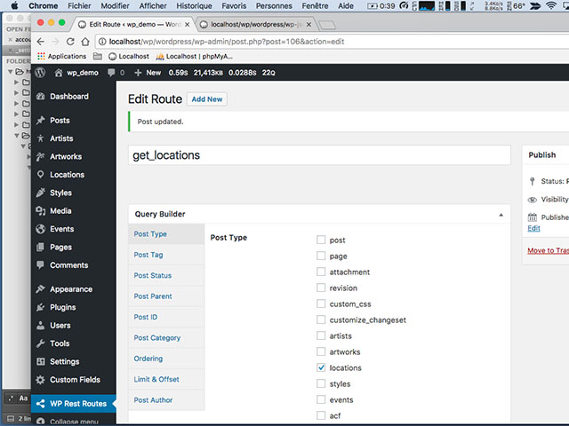
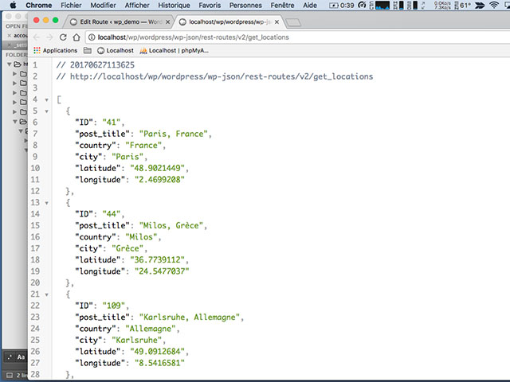
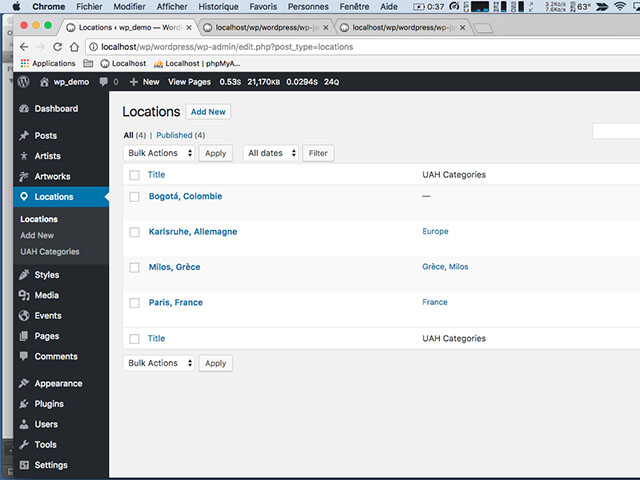
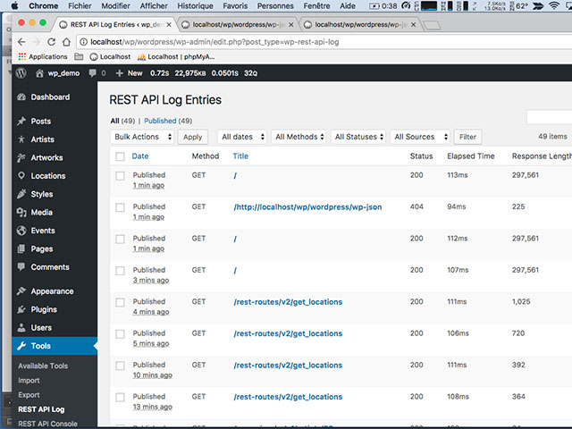
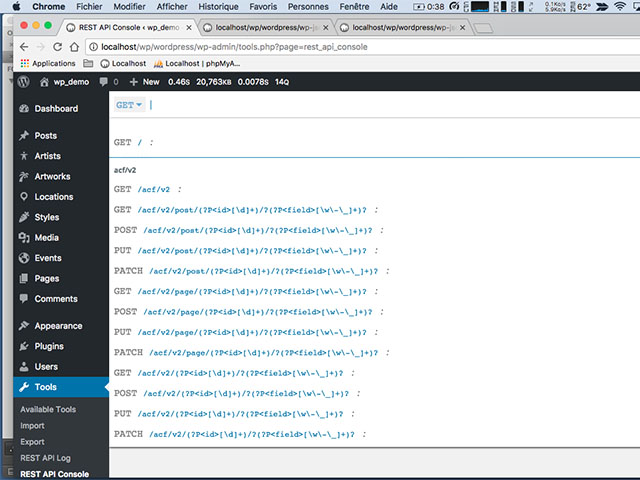

<a id="top"></a>
# Leveraging on the WP API with WordPress <a href="../README.md">&#8592; Home</a>

An article about 2 important things: 
- Some advantages to choose WP as a CMS to build application on. It will give us the opportunity to introduce the API-first strategy and thrive the usage of WP as a API's backbone.
- A POC using the WP API to feed a mobile application both in Android or iOS. 


**All the resources used in that article are available on Github in [/4_testing_the_wp_api/](/4_testing_the_wp_api/)**

**<a href="#1_api">1. What is API centric or API First? &#8595;</a>**<br>
**<a href="#2_api">2. Using or not using WordPress? &#8595;</a>**<br>

**<a href="#2_api">2.1 Why you may WANT to use WordPress. &#8595;</a>**<br>
<a href="#2_1_1_api">2.1.1 You are already addicted to WordPress &#8595;</a><br>
<a href="#2_1_2_api">2.1.2 Content Management with WordPress is easy as 1,2,3 &#8595;</a><br>
<a href="#2_1_3_api">2.1.3 Managing Users is not an issue &#8595;</a><br>
<a href="#2_1_4_api">2.1.4 Tons of Plugins &#8595;</a><br>
<a href="#2_1_5_api">2.1.5 WordPress is flexible &#8595;</a><br>
<a href="#2_1_6_api">2.1.6 WordPress is secured if... you do the frequent security updates &#8595;</a><br>
<a href="#2_1_7_api">2.1.7 Cost &#8595;</a><br>
<a href="#2_1_8_api">2.1.8 Responses to some common criticisms of Wordpress &#8595;</a><br>
**<a href="#2_2_api">2.2 Why you may NOT WANT to use WordPress &#8595;</a>**<br>
<a href="#2_2_1_api">2.2.1 There is another platform that will get you “there” faster &#8595;</a><br>
<a href="#2_2_2_api">2.2.2 Flexibility Is NOT Important to You &#8595;</a><br>
<a href="#2_2_3_api">2.2.3 Your app needs to be highly real time &#8595;</a><br>

**<a href="#3_api">3. Does WordPress can compete with Symfony or Laravel &#8595;</a>**<br>
<a href="#3_1_api">3.1 Models = plugins &#8595;</a><br>
<a href="#3_2api">3.2 Views = themes &#8595;</a><br>
<a href="#3_3_api">3.3 Controllers = template loader &#8595;</a><br>


**<a href="#4_api">4. Let's try to explore the WP API  &#8595;</a>**<br>


<a id="1_api"></a>
## 1. What is API centric or API First? <a href="#top">&#8593;</a>
Many companies start with building web or mobile applications, and only then as a side project they build an API for third party companies or for integration purposes. 

Therefore, they see it then as two channels: one web or mobile channel and one API channel. 

**The problem with this approach is that it results in an artificial API that wasn't properly built and tested during design.**

A better approach is to build the API first and build your web or mobile applications on top of that API. It will force you to design an API, test and use it for your own app so that it's a more real-world and developer-friendly REST API.

**An even better approach is to think about your strategy targeting the markets or usages you may want to address and then glue them to your API. It will give you a better big picture of what can be done by adopting an API centric strategy and will be able to share it easily.**


**API definition by the usages**


Source: <a href="https://webdevstudios.com/" target="_blank">https://webdevstudios.com/</a>

- To understand strategy for API first, you can check: <a href="https://www.restcase.com/" target="_blank">https://www.restcase.com/</a>

**CAUTION: We will describe a quick win strategy to start a successful building process by provisioning an API to a native mobile application by using WP for both iOS and Android devices. We will not cover the building of the application itself. Provisioning an API means offering through a web service, end-points to provide content to the mobile application.**


There is different ways to meet this challenge and exploring the process:
  - using an `App Wrapper`, basically a native mobile application with a webview. 
  - leveraging on `Hybrid Mobile` System such as PhoneGap, Ionic, Mobile Angular UI, React Native.
  - leveraging on a `Progressive Web App`, or `PWA`. To summarize, PWA is a website that has the appearance and behavior of a native mobile application. A PWA is based on web technologies. Depending on the browser and the system on which PWA runs, it can run offline, do background synchronizations, receive notifications, or be installed on a phone dashboard with an icon, such as a classic application.
  - enrolling a developer for native development!

**If you are interested by some of these subjects please check the following resources.**

-  More about PWS, check Show Cases (2018): <a href="https://developers.google.com/web/showcase/2018/" target="_blank">https://developers.google.com/web/showcase/2018/</a>
- More about Mobile Hybrid Apps, check 12 Frameworks for Mobile Hybrid Apps: <a href="https://blog.jscrambler.com/10-frameworks-for-mobile-hybrid-apps/" target="_blank">https://blog.jscrambler.com/10-frameworks-for-mobile-hybrid-apps/</a>


<a id="2_api"></a>
## 2. Using or not using WordPress? <a href="#top">&#8593;</a>

First of all. No single programming language or software tool will be right for every job. There is no panacea.

Let's quickly cover the 2 questions:

**2.1 Why you may WANT to use WordPress.**

**2.2 Why you may NOT WANT to use WordPress**

<a id="2_1_api"></a>
### 2.1 Why you may WANT to use WordPress. <a href="#top">&#8593;</a>

<a id="2_1_1_api"></a>
**2.1.1 You are already addicted to WordPress** <a href="#top">&#8593;</a><br>
Good for you! And you are just a quick plugin away from adding the functionality you need. Building your application into your existing WordPress site will save you time and make things easier. So if your application is fairly straightforward, you can create a custom plugin on your WordPress site to program the functionality required for your mobile app.

<a id="2_1_2_api"></a>
**2.1.2 Content Management with WordPress is easy as 1,2,3** <a href="#top">&#8593;</a><br>
The first function of WordPress was indeed blogging, but with the introduction of Custom Post Types (CPTs), Custom Fields & Custom Taxonomy, a robust API, it has evolved into a fully functional content management system (CMS) and also can compete with Framework like Symfony, Laravel. Using WordPress for your app will give you one place to manage your app and all of your content.

<a id="2_1_3_api"></a>
**2.1.3 Managing Users is not an issue** <a href="#top">&#8593;</a><br>
WordPress has everything you need for adding both admin users and end users to your site. In addition to controlling access to content, the Roles and Capabilities system in WordPress is extensible and allows you to control what actions are available for certain groups of users. 

**For example, as a news website, if you have in mind to offer premium content. With WP, you can create a level to give to paying members an access to premium content on your site.**

<a id="2_1_4_api"></a>
**2.1.4 Tons of Plugins** <a href="#top">&#8593;</a><br>
WordPress has tons of plugins, you already know that. It means that someone else maybe worked on the feature you want! Just have to find it. Plugins extend the functionality of WordPress to do almost anything you can imagine. Here we will maintain a list of our favorite WordPress plugins.

**At the bottom, you can find powerful and free plugins that may enhance the experience on your WordPress and help you to forge your strategy both on desktop or on mobile.**

<a id="2_1_5_api"></a>
**2.1.5 WordPress is flexible** <a href="#top">&#8593;</a><br>
WordPress and PHP/MySQL in general aren't perfect for every task, but they are well suited for a wide range of tasks. Having one platform that will grow with your business can allow you to execute and pivot faster.

**For example, as a news website, if you have in mind to offer premium content. With WP, you can create a level to give to paying members an access to premium content on your site.**

**This concern for news site is even targeted specifically by an association between Google and Automattic  Inc, the parent company of WordPress.com, to develop an advanced open-source publishing and revenue-generating platform for news organizations.**

- More about Newspack @ <a href="https://newspack.blog/" target="_blank">https://newspack.blog/</a>

<a id="2_1_6_api"></a>
**2.1.6 WordPress is secured if... you do the frequent security updates** <a href="#top">&#8593;</a><br>
As WordPress is very used and popular aka "WordPress now powers 30% of the web, technically, it is used by 30% of the top 10 million sites based on traffic according to Alexa".

Source: <a href="https://w3techs.com/" target="_blank">https://w3techs.com/</a>

**It is a target of choice for hackers but the developers behind WordPress are quick to address vulnerabilities and release updates to fix them thanks to the millions of users.**

Since WordPress 3.7 was released, automatic updates for minor and security releases have become standard so WordPress makes applying these updates a quick and painless process that even novice web users can perform.

**Be careful anyway, like any application WordPress requires a certain implication to avoid depreciation and entropy. Backup often you website both medias files and database.**

<a id="2_1_7_api"></a>
**2.1.7 Cost** <a href="#top">&#8593;</a><br>
Yes, except the hosting service, WordPress is free. PHP is free. MySQL is free. Most plugins are free. 

**According to me, the WordPress learning curve is less steep than the one for Drupal or a PHP framework for instance but do not neglect the hidden cost of learning process. Learning WP like anything is time consuming. Do not neglect also, that sometimes, the best arbitrage sometimes remains to pay a developer for the creation of a plugin or buy a theme on a platform like envato.com**

<a id="2_1_8_api"></a>
**2.1.8 Responses to some common criticisms of Wordpress** <a href="#top">&#8593;</a><br>
There are some highly vocal critics of WordPress who will say that WordPress isn’t a good framework for building web apps, or that WordPress isn’t a framework at all. With all due respect to those with these opinions, we’d like to go over why we disagree. Here are some common criticisms:

<!-- WordPress is for blog -->
**(i) WordPress is just for blogs.**<br>
What was true, at the very beginning, is obviously false nowadays as WordPress has become a true and mature CMS.

<!-- WordPress is just for content sites -->
**(ii) WordPress is just for content sites.**<br>
Very similar to the previous critic! Yes indeed, WordPress is highly recommended for content website and especially for news website. 

**As we say before, technically with the help of the API, the CPTs...etc and plugins, WordPress can be extended practically in all desired directions.**

<!-- WordPress doesn’t scale -->
**(iii) WordPress doesn’t scale.**<br>
Installing and running WordPress on low-end hosting may cause your application slows down or crashes under heavy load but does it mean that WP doesn’t scale.

**Like for any application, you may have have to squeeze the most performance possible out of WordPress through optimization: optimal server configuration, caching, clever programming, all kind of improvements can be made.**

For your information, this subject has been addressed in <a href="/10_speeding_up_your_websites/">**All you need to know about WP optimization** &#8594;</a><br>


<!-- WordPress is insecure -->
**(iv) WordPress is insecure.**<br>
Like any open source product, there will be a trade-off to do with regard to security when using WordPress.

The security in WordPress is like walking back home at night in a deserted and poorly lit street or in a busy and illuminated street.

**What do you prefer? Having exposed all the hacks and the possible solutions or being left alone without any help to fix the security holes. According to me, "security through obscurity" is not an option.**


<!-- WordPress plugins are crap. -->
**(v) WordPress plugins, it sucks!** <br>
Again, there is a lot a bad plugin but by the time, you will become expert to vet them. A good advice is to write down a pros and cons check list for your plugin and use it as a grid to choose or refuse plugins, think like if you were hiring the developer. If you cannot find your find happiness then go for paid plugins! It will save time.

**However, checking free plugins is helping you to define what features you really want to implement in your WP and you’re still further ahead than you would be if you had to write everything yourself from scratch.**

<a id="2_2_api"></a>
### 2.2 Why you may NOT WANT to use WordPress <a href="#top">&#8593;</a>

<a id="2_2_1_api"></a>
**2.2.1 There is another platform that will get you “there” faster** <a href="#top">&#8593;</a><br>
If you have a strong experienced Ruby developers team, you should use Ruby to build your web app. If there is a platform, framework, or bundle that includes 80% of the features you need for your web app and WordPress doesn’t have anything similar, you should probably use that other platform.

<a id="2_2_2_api"></a>
**2.2.2 Flexibility Is NOT Important to You** <a href="#top">&#8593;</a><br>
One of the greatest features of a WordPress site is the ability to change parts to better fit your needs quickly. Generally, updating your theme or swapping plugins on a WordPress site will be faster than developing features from scratch on another platform.

**In cases where optimization and performance are more important than being able to quickly update the application, programming a native app or programming in straight PHP, is going to be the better choice.**

<a id="2_2_3_api"></a>
**2.2.3 Your app needs to be highly real time** <a href="#top">&#8593;</a><br>
As WP rely on a typical web server architecture even there are ways to improve the performance of this architecture using caching techniques and/or optimized server setups. You can even make WordPress asynchronous by using using AJAX calls or accessing the database with alternative clients. 

**If your application needs to be real-time and fully asynchronous, think twice about using WordPress. On some specific application, WP cannot compete with the same performance as a native app or something built using Node.js or other technologies specifically suited to real-time applications.**

<a id="3_api"></a>
### 3. Does WordPress can compete with Symfony or Laravel? <a href="#top">&#8593;</a>
First of all Symfony or Laravel are MVC Frameworks made in PHP. MVC stands for model-view-controller. 

**If you search Worpress vs Symfony or Laravel or the pros and the cons for WordPress against Symfony or Laravel. You will get tons of info without any firm statement on what to do. According me the question is irrelevant, there is no reason to compare the two. You do not compare a carrot with a tomato, do you ? Except if you try to compare each logical element from one to another using analogy.**

**The main benefits of using an MVC architecture are code reusability and separation of concerns. WordPress doesn't use an MVC architecture, but does in its own way encourage code reuse and separation of concerns.**


**How to explain the functioning of WordPress like a MVC-based application?**

The end user uses a controller, which manipulates the application state and data via a model, which then updates a view that is shown to the user. 


For example, in a blog application, a user might be looking at the recent posts page (a view). The user would click a post title, which would take the user to a new URL (a controller) that would load the post data (in a model) and display the single post (a different view).

<a id="3_1_api"></a>
**3.1 Models = plugins** <a href="#top">&#8593;</a><br>
In an MVC framework, the code that stores the underlying data structures and business logic are found in the models. This is where the programmers will spend the majority of their time.

In WordPress, plugins are the proper place to store new data structures, complex business logic, and custom post type definitions.

One way to make the separation of concerns more clear when adding view-like components to your WordPress plugins is to create a "templates" or "pages" folder and put your frontend code into it. Common practice is to allow templates to override the template used by the plugin. For example, when using WordPress with the Paid Memberships Pro plugin, you can place a folder called “paid-memberships-pro/pages” into your active theme to override the default page templates.

<a id="3_2_api"></a>
**3.2 Views = themes** <a href="#top">&#8593;</a><br>
In an MVC framework, the code to display data to the user is written in the views. This is where designers will spend the majority of their time.
In WordPress, themes are the proper place to store templating code and logic.
Again, the comparison here doesn't map one to one, but "views = themes" is a good starting point.

<a id="3_3_api"></a>
**3.3 Controllers = template loader** <a href="#top">&#8593;</a><br>
In an MVC framework, the code to process user input (in the form of URLs or `$_GET` or `$_POST` data) and decide which models and views to use to handle a request are stored in the controllers. Controller code is generally handled by a programmer and often set up once and forgotten about. The meat of the programming in an MVC application happens in the models and views.


In WordPress, all page requests (unless they are accessing a cached .html file) are processed through the index.php file and processed by WordPress according to the Template Hierarchy. The template loader figures out which file in the template should be used to display the page to the end user. For example, use search.php to show search results, single.php to show a single post, etc.

**It can be a very controversial topic among people making development. The idea is make the best of the approach. For a news website, we will definitely go with WP.**

<a id="4_api"></a>
### 4. Let's try to explore the WP API <a href="#top">&#8593;</a>


I have taken an example extracted from my personal Blog to illustrate how can converge to a mobile application with a minimum of work, with the help of WP API.

My objectives for this POC like in the previous post was double.

*Proof of concept to create a small Rest API with Slim, the minimalist PHP framework*<br>*<a href="http://flaven.fr/2017/05/proof-of-concept-to-create-a-small-rest-api-with-slim-the-minimalist-php-framework/" target="_blank">http://flaven.fr/2017/05/proof-of-concept-to-create-a-small-rest-api-with-slim-the-minimalist-php-framework/</a>*

1. This API should populate data for mobile application so I must be able to minimize/shrink the values exposed in the JSON output.

2. As it is a POC, my purpose is to be totally autonomous. I do not want to rely on developers in the conception and creation of this API.


**Why should I reinvent the wheel? So why do not leverage on WordPress and especially since the version of WP 4.4, WP has a powerful API.**

For those, who know already WP, I will just indicate what I will try to make the best of WP using : Post Type, Taxonomy, Custom Fields... etc.

I had in mind this time not an API to manage translations but an API to handle Urban Art Spots such as the website Urbacolors.

**The WP REST API ecosystem**

Here is the list of plugin that will enhance and ease your experience within the WP REST API.

I have tested them all, according to my needs, here is my feedback on each of them.

**These 3 plugins : REST API Log, WP Rest Routes, REST API Console are essential. If you want to work with the WP API, it is required.**

- **1. ACF to REST API:** in my opinion, you’ll better use this plugin instead of ACF to WP API. It goes as a kind of « bundle » with the ACF (Advanced Custom Fields) Plugin for WordPress. Very powerful if you intend to use Custom Fields within your API.

- **2. WP REST API:** when you are using WP 4.4 and more, it is useless to install this plugin.

- **3. WP REST API Cache:** when you are in the development phase, it is useless to work with a cache because you can not see immediately the changes in JSON format for instance. In production, you can use it for sure.


**Make you own plugin**

The thing is that it is very easy to create your own plugin within WP especially if you want to use post_type. That is the best to do. It is a main purpose of my plug-in : managing 5 post_type with a custom and common taxonomy.

For some purpose, I did also some Custom Fields but believe me, better use the ACF plugin for POC at least and making Custom Fields, with the help of ACF (Advanced Custom Fields) plugin is a piece of cake.

**I have made 2 « uncompleted » but sufficient plugins for the POC.
You can find on github. Look for bf_poc_api_wp in 
<a href="https://github.com/bflaven/PluginWordpressForFun" target="_blank">https://github.com/bflaven/PluginWordpressForFun</a>**

- Urban Art Hunting App
- WP REST API Urban Art Hunting App

**Few Web API Endpoint Reference for WP API**

``` html
<!-- main Endpoint -->
http://[path-to-your-worpress]/wp-json/wp/v2/
<!-- Posts Endpoint -->
http://[path-to-your-worpress]/wp-json/wp/v2/posts
<!-- etc... -->
```

If you declare for each post_type 'show_in_rest' => true,, automatically the WP API will show up your post_type.
You will get 2 routes with the same methods as you will have for the posts

**For instance, our post_type is named locations. Show all the locations**

*wp/v2/locations*

``` json
"methods": [
        "GET",
        "POST"
      ],
```

**All methods for each locations record**

*wp/v2/locations/(?P<id>[\\d]+)*
``` json
"methods": [
        "GET",
        "POST",
        "PUT",
        "PATCH",
        "DELETE"
      ],
```

Some of the routes that automatically created by WP


**Part 1 : The routes of the WordPress API**


**Part 2 : The routes of the WordPress API**


### Use the REST API plugins
This Plugin WP Rest Routes is great. It will enable you to manage the routes of your API and the data displayed for each route. It is a true vital plugin.
In my opinion, the other 2 plugins (REST API Log, REST API Console) are useful but not vital.

**Plugin WP Rest Routes – Part 1**




**Plugin WP Rest Routes – Part 2**


**Plugin WP Rest Routes – Part 3 – JSON output from the route get_locations defined in the Plugin WP Rest Routes**


**The input of our previous screens capture inside the admin of WP, our post_type is named locations**



**The REST API Log useful to get data on traffic and on API’s usage**


**The REST API Console plug-in that simply list the endpoints. Not bad**



**Conclusion**

WP API has several advantages. I will stress 2 of them.

1. Using WP gives the opportunity to anyone to create content that will be displayed in the API. It seems obvious but when you are working with people specialized for instance in Art, Literature or in any area. It is better to let them create the content to avoid any mistakes. Focus on the container and not on the content should be your motto.

2. With the help of the Plugin WP Rest Routes, you have the ability to design the architecture quickly with all the routes of your future API. Thus, it will give you a living example for your future development with more experienced developers. According to the proverb : « A picture is worth a thousand words ».

<!-- part_1 -->
### For API WP <a href="#top">&#8593;</a>
  
- wp-api-menus from Fulvio Notarstefano<br><a href="https://github.com/unfulvio/wp-api-menus/tree/master/includes" target="_blank">https://github.com/unfulvio/wp-api-menus/tree/master/includes</a>
- Leveraging the WordPress REST API<br><a href="https://cnpagency.com/blog/leveraging-the-wordpress-rest-api/" target="_blank">https://cnpagency.com/blog/leveraging-the-wordpress-rest-api/</a>  
  
- WP REST API Part 2: Customizing Default Endpoints and Adding New Ones<br><a href="https://deliciousbrains.com/wp-rest-api-customizing-endpoints-adding-new-ones/" target="_blank">https://deliciousbrains.com/wp-rest-api-customizing-endpoints-adding-new-ones/</a>  
  
- Adding custom routes to the WordPress REST API<br><a href="https://torquemag.io/2015/06/adding-custom-routes-wordpress-rest-api/" target="_blank">https://torquemag.io/2015/06/adding-custom-routes-wordpress-rest-api/</a>  
  
- WP API: Adding Custom Endpoints<br><a href="https://webdevstudios.com/2016/05/24/&#10;wp-api-adding-custom-endpoints/" target="_blank">https://webdevstudios.com/2016/05/24/<br> wp-api-adding-custom-endpoints/</a>  
  
- How to: create a custom endpoint with the core REST API in WordPress<br><a href="http://wpcode.io/create-custom-endpoint-core-rest-api-wordpress/" target="_blank">http://wpcode.io/create-custom-endpoint-core-rest-api-wordpress/</a>  
  
- Adding fields to the JSON response + Removing fields from the JSON response<br><a href="https://css-tricks.com/using-the-wp-api-to-fetch-posts/" target="_blank">https://css-tricks.com/using-the-wp-api-to-fetch-posts/</a>  
  
- My best practices to developing with WP-API<br><a href="https://www.roysivan.com/my-best-practices-to-developing-wp-api/" target="_blank">https://www.roysivan.com/my-best-practices-to-developing-wp-api/</a>  
  
- Unset data from WordPress API (wp-json)<br><a href="https://stackoverflow.com/questions/32511201/unset-data-from-wordpress-api-wp-json" target="_blank">https://stackoverflow.com/questions/32511201/unset-data-from-wordpress-api-wp-json</a>  
  
- REST API Usage Example<br><a href="https://generatewp.com/snippet/pNkKpVE/" target="_blank">https://generatewp.com/snippet/pNkKpVE/</a>  
  
- Working with post meta data using the WordPress REST API<br><a href="https://torquemag.io/2015/07/working-with-post-meta-data-using-the-wordpress-rest-api/" target="_blank">https://torquemag.io/2015/07/working-with-post-meta-data-using-the-wordpress-rest-api/</a>  
  
- Excellent post from Basememara – Full Stack iOS and WordPress in Swift<br><a href="http://basememara.com/full-stack-ios-and-wordpress-in-swift/" target="_blank">http://basememara.com/full-stack-ios-and-wordpress-in-swift/</a>  
  
- Compatible Plugins &amp; Tools from WP REST API<br><a href="http://v2.wp-api.org/guide/plugins/" target="_blank">http://v2.wp-api.org/guide/plugins/</a>  

<!-- part_2 -->
### For Custom Post Types, Custom Fields &amp; Custom Taxonomy <a href="#top">&#8593;</a>

  
- Custom post types in WordPress<br><a href="http://justintadlock.com/archives/2010/04/29/custom-post-types-in-wordpress" target="_blank">http://justintadlock.com/archives/2010/04/29/custom-post-types-in-wordpress</a>  
  
- Plugin Advanced Custom Fields<br><a href="https://wordpress.org/plugins/advanced-custom-fields/" target="_blank">https://wordpress.org/plugins/advanced-custom-fields/</a>  
  
- Adding Custom Fields to a Custom Post Type, the Right Way<br><a href="http://blog.teamtreehouse.com/adding-custom-fields-to-a-custom-post-type-the-right-way&#10;" target="_blank">http://blog.teamtreehouse.com/adding-custom-fields-to-a-custom-post-type-the-right-way<br> </a>  
  
- WordPress custom post types and advanced custom fields<br><a href="https://www.freshconsulting.com/wordpress-custom-post-types-advanced-custom-fields/" target="_blank">https://www.freshconsulting.com/wordpress-custom-post-types-advanced-custom-fields/</a>  
  
- Ultimate Guide to Custom Post Types in WordPress<br><a href="https://typerocket.com/ultimate-guide-to-custom-post-types-in-wordpress/" target="_blank">https://typerocket.com/ultimate-guide-to-custom-post-types-in-wordpress/</a>  
  
- Unable to save custom taxonomy terms in a custom-built metabox from stackexchange<br><a href="https://wordpress.stackexchange.com/questions/9015/unable-to-save-custom-taxonomy-terms-in-a-custom-built-metabox" target="_blank">https://wordpress.stackexchange.com/questions/9015/unable-to-save-custom-taxonomy-terms-in-a-custom-built-metabox</a>  
  
- Saving Taxonomy Terms from stackexchange<br><a href="https://wordpress.stackexchange.com/questions/1794/saving-taxonomy-terms" target="_blank">https://wordpress.stackexchange.com/questions/1794/saving-taxonomy-terms</a>  
  
- The Custom Post Types Guide for WordPress<br><a href="https://www.wpmayor.com/ultimate-guide-wordpress-custom-post-types/" target="_blank">https://www.wpmayor.com/ultimate-guide-wordpress-custom-post-types/</a>  
  
- WordPress Taxonomies Extra Fields the easy way<br><a href="https://en.bainternet.info/wordpress-taxonomies-extra-fields-the-easy-way/" target="_blank">https://en.bainternet.info/wordpress-taxonomies-extra-fields-the-easy-way/</a>  


### Create a Meta Box in WP <a href="#top">&#8593;</a>

- Add a Metabox to Your Custom Post Type Screen<br><a href="http://shibashake.com/wordpress-theme/add-metabox-custom-post-type" target="_blank">http://shibashake.com/wordpress-theme/add-metabox-custom-post-type</a>  
  
- WordPress Meta Boxes<br><a href="https://rudrastyh.com/wordpress/meta-boxes.html" target="_blank">https://rudrastyh.com/wordpress/meta-boxes.html</a>  
  
- How To Create WordPress Meta Boxes<br><a href="https://www.smashingmagazine.com/2011/10/create-custom-post-meta-boxes-wordpress/" target="_blank">https://www.smashingmagazine.com/2011/10/create-custom-post-meta-boxes-wordpress/</a>  
  
- Create custom taxonomy and Display in metabox dropdown from stackexchange<br><a href="https://wordpress.stackexchange.com/questions/80059/create-custom-taxonomy-and-display-in-metabox-dropdown" target="_blank">https://wordpress.stackexchange.com/questions/80059/create-custom-taxonomy-and-display-in-metabox-dropdown</a>  
  
- Code add-metabox-to-taxonomy.php<br><a href="https://gist.github.com/ms-studio/543a0f7dd8ac05ccf037" target="_blank">https://gist.github.com/ms-studio/543a0f7dd8ac05ccf037</a>  
  
- How I add a WordPress MetaBox<br><a href="https://en.bainternet.info/how-i-add-a-wordpress-metabox/" target="_blank">https://en.bainternet.info/how-i-add-a-wordpress-metabox/</a>  
  
- My WordPress Meta box Class from bainternet<br><a href="https://github.com/bainternet" target="_blank">https://github.com/bainternet</a>  
  
- How To Create A Better Meta Box In WordPress Post Editing Page<br><a href="http://deluxeblogtips.com/how-to-create-meta-box-wordpress-post/" target="_blank">http://deluxeblogtips.com/how-to-create-meta-box-wordpress-post/</a>  
  
- WordPress Meta Boxes: a Comprehensive Developer’s Guide<br><a href="https://themefoundation.com/wordpress-meta-boxes-guide/" target="_blank">https://themefoundation.com/wordpress-meta-boxes-guide/</a>  
  
- Add special meta box to custom post type from Stackexchange<br><a href="https://wordpress.stackexchange.com/questions/186026/add-special-meta-box-to-custom-post-type" target="_blank">https://wordpress.stackexchange.com/questions/186026/add-special-meta-box-to-custom-post-type</a>  
  
- WordPress Meta Box for custom post type from stackoverflow<br><a href="https://stackoverflow.com/questions/24587751/wordpress-meta-box-for-custom-post-type" target="_blank">https://stackoverflow.com/questions/24587751/wordpress-meta-box-for-custom-post-type</a>  
  
- Adding a custom post type with custom meta box in wordpress<br><a href="https://return-true.com/adding-custom-post-type-and-custom-meta-box-in-wordpress/" target="_blank">https://return-true.com/adding-custom-post-type-and-custom-meta-box-in-wordpress/</a>  

<!-- part_3 -->
### Parent Child Relationships issue <a href="#top">&#8593;</a>

- Creating Post Type Relationships<br><a href="https://wp-types.com/documentation/user-guides/creating-post-type-relationships/" target="_blank">https://wp-types.com/documentation/user-guides/creating-post-type-relationships/</a>  
  
- The Practical Guide to Multiple Relationships Between Posts in WordPress<br><a href="https://onextrapixel.com/the-practical-guide-to-multiple-relationships-between-posts-in-wordpress/" target="_blank">https://onextrapixel.com/the-practical-guide-to-multiple-relationships-between-posts-in-wordpress/</a>  
  
- Relationships between Post Types in WordPress<br><a href="http://jancbeck.com/articles/relationships-between-wordpress-post-types" target="_blank">http://jancbeck.com/articles/relationships-between-wordpress-post-types</a>  
  
- Relation Post Types : Faire des relations entre les contenus de WordPress !<br><a href="http://www.herewithme.fr/2010/08/16/relation-post-types-faire-des-relations-entre-les-contenus-de-wordpress/" target="_blank">http://www.herewithme.fr/2010/08/16/relation-post-types-faire-des-relations-entre-les-contenus-de-wordpress/</a>  
  
- Post relationships: Parent-to-child<br><a href="http://justintadlock.com/archives/2013/10/07/post-relationships-parent-to-child" target="_blank">http://justintadlock.com/archives/2013/10/07/post-relationships-parent-to-child</a>  
  
- Part 9 – Many-to-many relationships in Toolset<br><a href="https://wp-types.com/documentation/toolset-training-course/part-9-many-to-many-relationships-in-toolset/" target="_blank">https://wp-types.com/documentation/toolset-training-course/part-9-many-to-many-relationships-in-toolset/</a>  
  
- Many to Many Relationship between Two Custom Post Types<br><a href="https://wordpress.stackexchange.com/questions/51386/many-to-many-relationship-between-two-custom-post-types" target="_blank">https://wordpress.stackexchange.com/questions/51386/many-to-many-relationship-between-two-custom-post-types</a>  
  
- One-to-many Relationships in WordPress<br><a href="https://codeseekah.com/2012/02/14/one-to-many-relationships-in-wordpress/" target="_blank">https://codeseekah.com/2012/02/14/one-to-many-relationships-in-wordpress/</a>  
  
- Understanding and Working with Relationships Between Data in WordPress<br><a href="https://code.tutsplus.com/tutorials/understanding-and-working-with-relationships-between-data-in-wordpress--cms-20632" target="_blank">https://code.tutsplus.com/tutorials/understanding-and-working-with-relationships-between-data-in-wordpress–cms-20632</a>  
  
- Create many-to-many relationships between posts of any type using post 2 post plugin<br><a href="https://premium.wpmudev.org/forums/topic/create-many-to-many-relationships-between-posts-of-any-type-using-post-2-post-plugin" target="_blank">https://premium.wpmudev.org/forums/topic/create-many-to-many-relationships-between-posts-of-any-type-using-post-2-post-plugin</a>  
  
- Using 1 taxonomy for multiple post types? from stackexchange<br><a href="https://wordpress.stackexchange.com/questions/86864/using-1-taxonomy-for-multiple-post-types" target="_blank">https://wordpress.stackexchange.com/questions/86864/using-1-taxonomy-for-multiple-post-types</a>  
  
- Add Exactly The Same Taxonomies To Multiple Custom Post Types<br><a href="https://wpsites.net/wordpress-admin/add-exactly-the-same-taxonomies-to-mutiple-custom-post-types/" target="_blank">https://wpsites.net/wordpress-admin/add-exactly-the-same-taxonomies-to-mutiple-custom-post-types/</a>  
  
- Extending the Quick Edit Tool for Taxonomy Terms<br><a href="https://code.tutsplus.com/articles/extending-the-quick-edit-tool-for-taxonomy-terms--wp-20495" target="_blank">https://code.tutsplus.com/articles/extending-the-quick-edit-tool-for-taxonomy-terms–wp-20495</a>  
  
- WordPress post to post relationships, without altering the Database, excellent post on one-to-many in WP<br><a href="http://www.danielauener.com/wordpress-post-to-post-relationships-without-altering-the-database/" target="_blank">http://www.danielauener.com/wordpress-post-to-post-relationships-without-altering-the-database/</a>  
  
- Creating Many to Many Relationships Between Posts in WordPress<br><a href="https://www.never5.com/blog/creating-many-many-relationships-posts-wordpress/" target="_blank">https://www.never5.com/blog/creating-many-many-relationships-posts-wordpress/</a>  
  
- WordPress, custom post type relationship to many post from stackoverflow<br><a href="https://stackoverflow.com/questions/31308217/wordpress-custom-post-type-relationship-to-many-post" target="_blank">https://stackoverflow.com/questions/31308217/wordpress-custom-post-type-relationship-to-many-post</a>  
  
- Relating Posts, Pages, and Custom Post Types in WordPress<br><a href="https://www.webmalama.com/relating-posts-pages-custom-post-types-wordpress/" target="_blank">https://www.webmalama.com/relating-posts-pages-custom-post-types-wordpress/</a>  
  
- How to set parent-child relationship between differents custom post types<br><a href="https://wordpress.stackexchange.com/questions/181134/how-to-set-parent-child-relationship-between-differents-custom-post-types" target="_blank">https://wordpress.stackexchange.com/questions/181134/how-to-set-parent-child-relationship-between-differents-custom-post-types</a>  
  
- Extending WordPress With Custom Content Types<br><a href="https://www.smashingmagazine.com/2015/04/extending-wordpress-custom-content-types/" target="_blank">https://www.smashingmagazine.com/2015/04/extending-wordpress-custom-content-types/</a>  
  
- How to Use Radio Buttons With Taxonomies<br><a href="https://code.tutsplus.com/articles/how-to-use-radio-buttons-with-taxonomies--wp-24779" target="_blank">https://code.tutsplus.com/articles/how-to-use-radio-buttons-with-taxonomies–wp-24779</a>  
  
- WordPress: Custom post types and parent-child relationships<br><a href="http://typecode.digital/wordpress-custom-post-types-and-parent-child-relationships/" target="_blank">http://typecode.digital/wordpress-custom-post-types-and-parent-child-relationships/</a>  

<!-- part_4 -->
### Plugins <a href="#top">&#8593;</a>

- Plugin Custom Post Type UI<br><a href="https://wordpress.org/plugins/custom-post-type-ui/" target="_blank">https://wordpress.org/plugins/custom-post-type-ui/</a>  
  
- Plugin Posts 2 Posts<br><a href="https://wordpress.org/plugins/posts-to-posts/" target="_blank">https://wordpress.org/plugins/posts-to-posts/</a>  
  
- Posts 2 Posts, un plugin pour créer des relations entre les types de contenus de WordPress<br><a href="https://wpchannel.com/posts-2-posts-plugin-creer-relations-custom-post-types/" target="_blank">https://wpchannel.com/posts-2-posts-plugin-creer-relations-custom-post-types/</a>  


### Other Resources <a href="#top">&#8593;</a>  
- Personnaliser l’icône d’un custom post type avec la police dashicons<br><a href="http://www.geekpress.fr/personnaliser-licone-dun-custom-post-type-police-dashicon/" target="_blank">http://www.geekpress.fr/personnaliser-licone-dun-custom-post-type-police-dashicon/</a>  
  
- How To Design And Style Your WordPress Plugin Admin Panel<br><a href="https://onextrapixel.com/how-to-design-and-style-your-wordpress-plugin-admin-panel/" target="_blank">https://onextrapixel.com/how-to-design-and-style-your-wordpress-plugin-admin-panel/</a>  


## Yet another extended list of useful plugins...
  
### Developer Tools <a href="#top">&#8593;</a><br>
- Kint Debugger is a simple wrapper for Kint, a debugging tool to output information about variables and traces in a styled, collapsible format that makes understanding deep arrays and objects easier. (excellent for print_r, var_dump...)<br><a href="https://wordpress.org/plugins/kint-debugger/" target="_blank">Kint Debugger</a>


- Query Monitor is the developer tools panel for WordPress. It enables debugging of database queries, PHP errors, hooks and actions, block editor blocks, enqueued scripts and stylesheets, HTTP API calls, and more.<br><a href="https://wordpress.org/plugins/query-monitor/" target="_blank">Query Monitor</a>


### Downloads <a href="#top">&#8593;</a><br>
- A good plugin to sell digital downloads through WordPress. The core plugin is Free, the extensions are available for purchase on the official website.<br><a href="https://easydigitaldownloads.com/" target="_blank">Easy Digital Downloads</a>


### eCommerce <a href="#top">&#8593;</a><br>
- The Jigoshop ecommerce plugin is released under the GPL license and available in the WordPress plugin repository.<br><a href="http://www.jigoshop.com/" target="_blank">Jigoshop</a>
  
- WooCommerce, which was forked from Jigoshop, has improved both the underlying code and the number and quality of extensions.<br><a href="http://www.woothemes.com/woocommerce/" target="_blank">WooCommerce</a>


### Forms <a href="#top">&#8593;</a><br>
- This plugin is an absolute must because it enables you to easily create custom contact forms for your site.<br><a href="http://www.gravityforms.com/" target="_blank">Gravity Forms</a>  


### Maintenance <a href="#top">&#8593;</a><br>
- A paid plugin that gives the opportunity to back up your entire WordPress install for safekeeping, restoring, or moving your site. <br><a href="http://ithemes.com/purchase/backupbuddy/" target="_blank">Backup Buddy</a>


  
-  W3 Total Cache has a lot of built-in features for managing caching content.<br><a href="https://wordpress.org/plugins/w3-total-cache/" target="_blank">W3 Total Cache</a>

  
### Membership <a href="#top">&#8593;</a><br>
- Announced as "The Most Complete Membership Solution for Your WordPress Site." and indeed Paid Memberships Pro is a very powerful plugin which allows you to restrict content to your users based on customized Membership Levels.<br><a href="http://paidmembershipspro.com" target="_blank">Paid Memberships Pro</a>


### Mobile <a href="#top">&#8593;</a><br>
- This plugin that will allow you to build an iOS and/or Android app based off your own responsive mobile theme or a selected AppPresser theme. Pretty expensive but worth it!<br><a href="http://apppresser.com/" target="_blank">AppPresser</a>


### Other <a href="#top">&#8593;</a><br>
- A plugin for rewarding members achievements based on their activities. Good starter to improve community management.<br><a href="http://badgeos.org/" target="_blank">BadgeOS</a>

  
### Security <a href="#top">&#8593;</a><br>
- Hide Admin Bar from Non-Admins. Perfect for sites where there is only one admin who needs access to the dashboard and the admin bar.<br><a href="http://www.paidmembershipspro.com/add-ons/plugins-wordpress-repository/hide-admin-bar-from-non-admins/" target="_blank">Hide Admin Bar from Non-Admins</a>

- This plugin will make sure users are only logged in from one computer or device at a time.<br><a href="http://www.paidmembershipspro.com/add-ons/plugins-on-github/wp-bouncer/" target="_blank">WP Bouncer</a>
  
 
### SEO <a href="#top">&#8593;</a><br>
- Ze great plugin for SEO (search engine optimizations).<br><a href="https://wordpress.org/plugins/all-in-one-seo-pack/" target="_blank">All in One SEO Pack</a>


  


### Social <a href="#top">&#8593;</a><br>
- BuddyPress is social networking in a box.<br><a href="https://buddypress.org/" target="_blank">BuddyPress</a>

  


### Theme <a href="#top">&#8593;</a><br>
- With this plugin, you can customize for instance the login page to match your theme to create a seamless experience for the end user and do some other features: handle themed profiles, user moderation, custom redirection...<br><a href="https://wordpress.org/plugins/theme-my-login/" target="_blank">Theme My Login</a>


### User Management <a href="#top">&#8593;</a><br>
- Excellent plugin. Members is a plugin that extends your control over your blog. It’s a user, role, and capability editor plugin that was created to make WordPress a more powerful CMS.<br><a href="https://wordpress.org/plugins/members/" target="_blank">Members</a>

  


