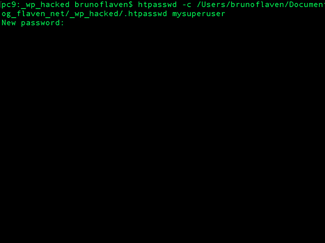
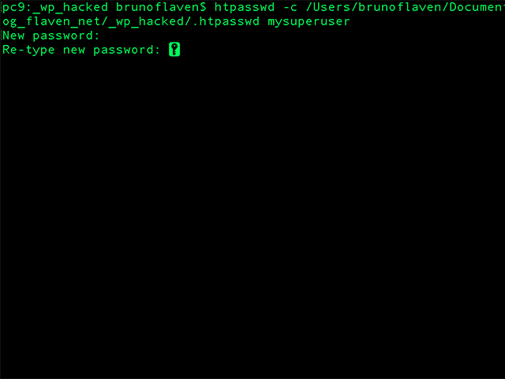
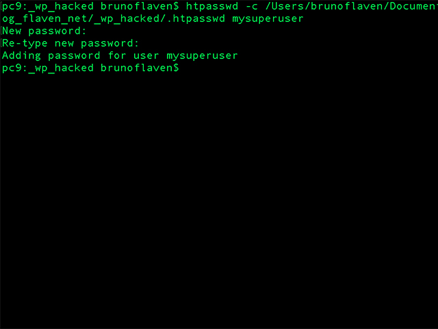

<a id="top"></a>
# Manage security in WP

The WordPress security is a hell of topic for every website owner. Just to have an rough idea, Google blacklists around 10,000+ websites every day for malware and around 50,000 for phishing every week.

If you are dedicated to your website, then you need to pay attention to the WordPress security best practices. In this post, we will share some WordPress security tips to help you protect your website against hackers and malware and also see what to do in case your site has been hacked.


**<a href="#security_1">1. Make a todolist for your WP security** &#8595;</a><br>
**<a href="#security_2">2. In case of hacking** &#8595;</a><br>
**<a href="#security_3">3. Main security measures you can do or not...** &#8595;</a><br>
**<a href="#security_4">4. A possible .htaccess for your WP** &#8595;</a><br>
**<a href="#security_5">5. Read more** &#8595;</a><br>


One of the thing that any owner of a WP site can be afraid of is the the fear of being hacked. There are few good practices that should be done every week or every daily basis for example:

- Make backup of your website (database, media...). Made mostly on a server side.
- For your personal information, keep track in a README of the all changes that I have been made in your theme, plugins installation, update... etc. **The best thing to do remains to have a git repository and activate gitflow on it**
- Avoid installing plugins without fully testing them.
- Change your password and pick up one with a strong security pattern (Admin, MySQL, Users)
- ... keep thinking of what is key in terms of security

<a id="security_1"></a>
## 1. Make a todolist for your WP security<a href="#top">&#8593;</a><br>
**All of these guarantees are designed to protect the initial investment and the potential for this investment in the future.**

In order, to do not forget anything, let's browse quickly the todolist provided by wpbeginner.com

**(i) Basics of WordPress Security**<br>
- Why WordPress Security is Important?
- Keeping WordPress Updated
- Passwords and User Permissions
- The Role of Web Hosting

**(ii) WordPress Security in Easy Steps (No Coding)**<br>
- Install a WordPress Backup Solution
- Best WordPress Security Plugin
- Enable Web Application Firewall (WAF)
- Move WordPress Site to SSL/HTTPS

**(iii) WordPress Security for DIY Users (Do-It-Yourself)**<br>
- Change the Default “admin” username
- Disable File Editing
- Disable PHP File Execution
- Limit Login Attempts
- Add Two Factor Authentication
- Change WordPress Database Prefix
- Password Protect WP-Admin and Login
- Disable Directory Indexing and Browsing
- Disable XML-RPC in WordPress
- Automatically log out Idle Users
- Add Security Questions to WordPress Login
- Scanning WordPress for Malware and Vulnerabilies
- Fixing a Hacked WordPress Site

Source: <a href="https://www.wpbeginner.com/wordpress-security/" target="_blank">https://www.wpbeginner.com/wordpress-security/</a>

<a id="security_2"></a>
## 2. In case of hacking<a href="#top">&#8593;</a><br>
Thinking about being hacked is a requirement when your are managing  a WP's website. It does have to be a obsession but this risk has to be present in your mind. Let say you should do sometime some rehearsal acting like if your site has been truly hacked. In a way, you should see that like a military workout routine or exercises to remain fit and ready!

We all know that WP is an easy, nice and economic way to make a website or even to run an API for a mobile application. Mostly because WordPress is very simple to take in hand for newbies.

**The drawback of WordPress is the extreme vulnerability of the CMS to hacking. If you possesses a WP in production, be sure to look after it, making the required updates especially both for themes, plugins and the core code. If not, soon your site will be vulnerable and an easy prey for hackers even the most novice ones.**

**Let's say, the hack has happened!**

Who to blame ? No-one, expect me, the site owner or both of us. Indeed, the updates have been not been made properly, nothing has been really made to secure the installation… I know few people who are managing web servers that I have a word for WP that is relegated to a noxious plague known as WordPox. I will keep silent also on some other words that are outrageously sexist and inaccurate towards WP if you intend to take some prophylactic measures, that we will see in a couple of lines below.

Anyway, the very first reaction when your site is hacked is that you feel sorry not to have been more cautious. When, you check the website from codex.wordpress.org, the first advice is pretty simple and quite wisely too.

**First: Stay calm.**

When addressing a security issue, as a website owner, you’re likely experiencing an undue amount of stress. It’s often the most vulnerable you have found yourself since being on line and it’s contrary to what every one told you, « Hey, WordPress is Easy!! »

Source : <a href="https://codex.wordpress.org/FAQ_My_site_was_hacked" target="_blank">https://codex.wordpress.org/FAQ_My_site_was_hacked</a>


**What kind of hack is that?**<br>
Just find this weird injection at the beginning of the wp-config.php file... Ugly, is that serious Doctor ?
Then, after, you find this, you just follow the thread of the ball to the source with the help of Google and Malwaredecoder.com

Here is a quick TodoList of what you imperatively need to do if your WP has been hacked

**The 9 commandments**<br>
1. Save the wp-config.php file, your images, and your personal files one by one (not the folder as it may contain unwanted files).

2. Make sure that there is no malicious code in the saved wp-config.php file.

3. Wipe out the entire folder where WordPress is installed.

4. Upload a new clean full package of the latest WordPress version.

5. Re-upload your wp-config.php file and images.

6. Re-install the latest versions of your plugins and themes.

7. Change the passwords for all WordPress admin users. Please use passwords that are hard to guess.

8. Change the hosting Control Panel password and all MySQL passwords.

9. Some kind of SQL queries that will help to check the content of your database if there’s been some damages.


``` sql
SELECT * FROM wp_posts WHERE post_content LIKE '%<iframe%'
UNION
SELECT * FROM wp_posts WHERE post_content LIKE '%<noscript%'
UNION
SELECT * FROM wp_posts WHERE post_content LIKE '%display:%'
UNION
```

<a id="security_3"></a>
## 3. Main security measures you can do or not...<a href="#top">&#8593;</a><br>
**Next time, what can, you do to prevent such scenario to happen?**

Roughly, protecting WP consist of spreading Htaccess files everywhere! Htaccess files will help control the way visitors can interact with your website. The htaccess file is also used to block specific traffic from being able to view your website.

**1. Modify the existing .htaccess of WP**
The idea is to protect more carefully the access to some core files of WordPress eg wp-config.php, the .htaccess itself, prevent listing for directories...etc. You just have to modify the existing .htaccess of WP.

**2. Add your own .htaccess for /wp-admin/**
A second .htpasswd will be created to also secure more efficiently the administration dashboard

Be sure sure to place the .htpasswd, not in the root directory

**3. Create the file .htpasswd and add the user mysuperuser**

``` bash
htpasswd -c /[path-to-your-htpasswd-file]/.htpasswd mysuperuser
```

If you don’t current have an .htpasswd, use the « -c » option to create the file with the first user. It will prompt you for a password and encrypt it for you.

Command to list the files including the .htpasswd
``` bash
ls -la
```
If you already have the .htpasswd file and would like to append a new user, repeat the command with the « -c ».

Command to add a new user
``` bash
htpasswd -c /[path-to-your-htpasswd-file]/.htpasswd mysuperuser2
```

**Find the real path for your WP installation**<br>
In order to get the real path to your WordPress installation send a php file with the following command inside at the root directory of your installation.

``` php
echo (''.getcwd().'');
```

You will get printed probably something like this, depending your hosting service.

``` text
/home/[user-account-or-ftp-user-account]/www
```

**Create the .htpasswd file and add a new user named mysuperuser**<br>
<br>
*<code>Copyright &copy; flaven.fr</code>*


**Enter the password for mysuperuser**<br>
<br>
*<code>Copyright &copy; flaven.fr</code>*


**You are done. Send, via FTP, the file .htpasswd out of the root dir of your WP directory**<br>
<br>
*<code>Copyright &copy; flaven.fr</code>*

The .htaccess that have to uploaded in the wp-admin directory. Be sure to put the correct to the .htpasswd

``` apacheconf
# SECURITY WORDPRESS for wp-admin
AuthUserFile [path-out-the-wp-dir]/.htpasswd
AuthGroupFile /dev/null
AuthName "Access Restricted"
AuthType Basic
require valid-user
```


**4. Diagnose: Scanning the files of your previous WP**<br>
As you have made a fresh and new installation as you may need to re-upload some of the existing files from your previous WP eg uploads directory, plugins, themes...

I strongly advised you to scan these files that are probably infected, with malware more discrete, so you need to find and destroy it. These files are potential threats for your new WP such as backdoors, code injections, malicious iframes, hidden eval code, the the base64 family:base64_decode, gzinflate(base64_decode, eval(gzinflate(base64_decode, eval(base64_decode... and more. We have used for this task one of the most popular plugin named wordfence

Wisely, I have runned the plugin wordfence locally before uploading the all stuff on the new WP installation and guess what I found a bunch of crap installed by a hacker in order to perform malicious activity.

Launching the scan, being locally accelerated the scan process.

<a id="security_4"></a>
## 4. A possible .htaccess for your WP<a href="#top">&#8593;</a><br>

The definitive .htaccess for WP. This is not this .htaccess that will protect the directory /wp-admin/


``` apacheconf

# BEGIN WordPress
<IfModule mod_rewrite.c> 
RewriteEngine On
RewriteBase /
RewriteRule ^index\.php$ - [L]
RewriteCond %{REQUEST_FILENAME} !-f
RewriteCond %{REQUEST_FILENAME} !-d
RewriteRule . /index.php [L]
</IfModule> 
# END WordPress
 
# BEGIN SECURITY
 
# BEGIN ENVIRONMENT 
# SET register_globals to off security
SetEnv REGISTER_GLOBALS 0
# END ENVIRONMENT 
 
# NO listing for directories
Options All -Indexes
 
# NO listing for directories
IndexIgnore *
 
# Hide server informations
ServerSignature Off
 
# Enabling the tracking of symbolic links
Options +FollowSymLinks
 
# Time zone selection
SetEnv TZ Europe/Paris
 
# Default encoding of text and HTML files
AddDefaultCharset UTF-8
 
# protect wp-config.php
<Files wp-config.php> 
    order deny,allow
    deny from all
</Files>
 
# Protect .htaccess and .htpasswds files
<Files ~ "^.*\.([Hh][Tt][AaPp])"> 
  order allow,deny
  deny from all
  satisfy all
</Files> 
 
# Protect wp-login.php
<Files wp-login.php>
AuthUserFile [path-out-the-wp-dir]/.htpasswd
AuthName "Access Restricted"
AuthType Basic
require valid-user
</Files>
 
# Avoid comment spam
<IfModule mod_rewrite.c> 
RewriteCond %{REQUEST_METHOD} POST
RewriteCond %{REQUEST_URI} .wp-comments-post\.php*
RewriteCond %{HTTP_REFERER} !.your-site-domain.com.* [OR]
RewriteCond %{HTTP_USER_AGENT} ^$
RewriteRule (.*) ^http://%{REMOTE_ADDR}/$ [R=301,L]
</IfModule> 
 
 
 
 
# Avoid discovering an author's ID
<IfModule mod_rewrite.c> 
RewriteCond %{QUERY_STRING} ^author=([0-9]*)
RewriteRule .* - [F]
</IfModule> 
 
# Disable the hot-linking of your images
RewriteEngine On
RewriteCond %{HTTP_REFERER} !^$
RewriteCond %{HTTP_REFERER} !^http(s)?://(www\.)?your-site-domain.com [NC]
RewriteRule \.(jpg|jpeg|png|gif)$ https://fakeimg.pl/400x200/?text=no-way [NC,R,L]
 
 
 
# Caching files in the browser
<IfModule mod_expires.c> 
ExpiresActive On
ExpiresDefault "access plus 1 month"
 
ExpiresByType text/html "access plus 0 seconds"
ExpiresByType text/xml "access plus 0 seconds"
ExpiresByType application/xml "access plus 0 seconds"
ExpiresByType application/json "access plus 0 seconds"
ExpiresByType application/pdf "access plus 0 seconds"
 
ExpiresByType application/rss+xml "access plus 1 hour"
ExpiresByType application/atom+xml "access plus 1 hour"
 
ExpiresByType application/x-font-ttf "access plus 1 month"
ExpiresByType font/opentype "access plus 1 month"
ExpiresByType application/x-font-woff "access plus 1 month"
ExpiresByType application/x-font-woff2 "access plus 1 month"
ExpiresByType image/svg+xml "access plus 1 month"
ExpiresByType application/vnd.ms-fontobject "access plus 1 month"
 
ExpiresByType image/jpg "access plus 1 month"
ExpiresByType image/jpeg "access plus 1 month"
ExpiresByType image/gif "access plus 1 month"
ExpiresByType image/png "access plus 1 month"
 
ExpiresByType video/ogg "access plus 1 month"
ExpiresByType audio/ogg "access plus 1 month"
ExpiresByType video/mp4 "access plus 1 month"
ExpiresByType video/webm "access plus 1 month"
 
ExpiresByType text/css "access plus 6 month"
ExpiresByType application/javascript "access plus 6 month"
 
ExpiresByType application/x-shockwave-flash "access plus 1 week"
ExpiresByType image/x-icon "access plus 1 week"
 
</IfModule> 
 
# kill them etags
Header unset ETag
FileETag None
 
<ifModule mod_headers.c>  
<filesMatch "\.(ico|jpe?g|png|gif|swf)$">   
    Header set Cache-Control "public"  
</filesMatch>  
<filesMatch "\.(css)$">  
    Header set Cache-Control "public"  
</filesMatch>   
<filesMatch "\.(js)$">   
    Header set Cache-Control "private"  
</filesMatch>   
<filesMatch "\.(x?html?|php)$">   
    Header set Cache-Control "private, must-revalidate"
</filesMatch> 
</ifModule> 
 
 
# Compressions of static files
<IfModule mod_deflate.c> 
    AddOutputFilterByType DEFLATE text/xhtml text/html text/plain text/xml text/javascript application/x-javascript text/css 
    BrowserMatch ^Mozilla/4 gzip-only-text/html 
    BrowserMatch ^Mozilla/4\.0[678] no-gzip 
    BrowserMatch \bMSIE !no-gzip !gzip-only-text/html 
    SetEnvIfNoCase Request_URI \.(?:gif|jpe?g|png)$ no-gzip dont-vary 
    Header append Vary User-Agent env=!dont-vary 
</IfModule>   
 
AddOutputFilterByType DEFLATE text/html  
AddOutputFilterByType DEFLATE text/plain  
AddOutputFilterByType DEFLATE text/xml  
AddOutputFilterByType DEFLATE text/css  
AddOutputFilterByType DEFLATE text/javascript
AddOutputFilterByType DEFLATE font/opentype
AddOutputFilterByType DEFLATE application/rss+xml
AddOutputFilterByType DEFLATE application/javascript
AddOutputFilterByType DEFLATE application/json  
 
 
 
# Block the use of certain scripts
RewriteEngine On
RewriteBase /
RewriteRule ^wp-admin/includes/ - [F,L]
RewriteRule !^wp-includes/ - [S=3]
RewriteRule ^wp-includes/[^/]+\.php$ - [F,L]
RewriteRule ^wp-includes/js/tinymce/langs/.+\.php - [F,L]
RewriteRule ^wp-includes/theme-compat/ - [F,L]
 
 
# Protection against file injections
RewriteCond %{REQUEST_METHOD} GET
RewriteCond %{QUERY_STRING} [a-zA-Z0-9_]=http:// [OR]
RewriteCond %{QUERY_STRING} [a-zA-Z0-9_]=(\.\.//?)+ [OR]
RewriteCond %{QUERY_STRING} [a-zA-Z0-9_]=/([a-z0-9_.]//?)+ [NC]
RewriteRule .* - [F]
 
 
# Protections diverses (XSS, clickjacking et MIME-Type sniffing)
<ifModule mod_headers.c> 
Header set X-XSS-Protection "1; mode=block"
Header always append X-Frame-Options SAMEORIGIN
Header set X-Content-Type-Options: "nosniff”
</ifModule> 
 
# END SECURITY

```

Source: <a href="http://flaven.fr/2017/12/hack-wordpress-a-quick-introduction-to-diagnose-restore-and-protect-a-hacked-wordpress/" target="_blank">Hack, WordPress – A quick introduction to diagnose, restore and protect a hacked WordPress</a>

<a id="security_5"></a>
## 5. Read more<a href="#top">&#8593;</a><br>
- The Ultimate WordPress Security Guide – Step by Step (2019)<br><a href="https://www.wpbeginner.com/wordpress-security/" target="_blank">https://www.wpbeginner.com/wordpress-security/</a>

- 14 best WordPress security plugins (french)<br><a href="https://kinsta.com/fr/blog/plugins-securite-wordpress/" target="_blank">https://kinsta.com/fr/blog/plugins-securite-wordpress/</a>

- Plugin Security Scanner<br><a href="https://wordpress.org/plugins/plugin-security-scanner/" target="_blank">https://wordpress.org/plugins/plugin-security-scanner/</a>

- Plugin wordfence<br><a href="https://wordpress.org/plugins/wordfence/" target="_blank">https://wordpress.org/plugins/wordfence/</a>

- How To Scan Your WordPress Website For Hidden Malware<br><a href="https://www.elegantthemes.com/blog/tips-tricks/how-to-scan-your-wordpress-website-for-hidden-malware" target="_blank">https://www.elegantthemes.com/blog/tips-tricks/how-to-scan-your-wordpress-website-for-hidden-malware</a>

- How to Fix the Internal Server Error in WordPress<br><a href="http://www.wpbeginner.com/wp-tutorials/how-to-fix-the-internal-server-error-in-wordpress/" target="_blank">http://www.wpbeginner.com/wp-tutorials/how-to-fix-the-internal-server-error-in-wordpress/</a>

- WordPress piraté, hacké ? Comment réagir ? (french)<br><a href="https://wpformation.com/wordpress-pirate-hack/" target="_blank">https://wpformation.com/wordpress-pirate-hack/</a>

- Comment se fait hacker un site web WordPress ? (french)<br><a href="https://secupress.me/fr/blog/comment-hacker-site-wordpress/" target="_blank">https://secupress.me/fr/blog/comment-hacker-site-wordpress/</a>

- Analyzing The WordPress SoakSoak Favicon Backdoor<br><a href="https://blog.sucuri.net/2014/12/analyzing-the-wordpress-soaksoak-favicon-backdoor.html" target="_blank">https://blog.sucuri.net/2014/12/analyzing-the-wordpress-soaksoak-favicon-backdoor.html</a>

- Slider Revolution Plugin Critical Vulnerability Being Exploited<br><a href="https://blog.sucuri.net/2014/09/slider-revolution-plugin-critical-vulnerability-being-exploited.html" target="_blank">https://blog.sucuri.net/2014/09/slider-revolution-plugin-critical-vulnerability-being-exploited.html</a>

- Online PHP Decoder<br><a href="https://malwaredecoder.com/" target="_blank">https://malwaredecoder.com/</a>

- Brute Force Attacks<br><a href="https://codex.wordpress.org/Brute_Force_Attacks" target="_blank">https://codex.wordpress.org/Brute_Force_Attacks</a>

- Password Protecting wp-login.php with HTTP Authentication<br><a href="https://blogvault.net/password-protecting-wp-login-php-with-http-authentication/" target="_blank">https://blogvault.net/password-protecting-wp-login-php-with-http-authentication/</a>

- Protect WordPress Login from Brute Force Attacks with .htaccess<br><a href="https://ivycat.com/protect-wordpress-login-brute-force-attacks-htaccess/" target="_blank">https://ivycat.com/protect-wordpress-login-brute-force-attacks-htaccess/</a>

- FAQ My site was hacked<br><a href="https://codex.wordpress.org/FAQ_My_site_was_hacked" target="_blank">https://codex.wordpress.org/FAQ_My_site_was_hacked</a>

- How to Password Protect Your WordPress Admin (wp-admin) Directory<br><a href="http://www.wpbeginner.com/wp-tutorials/how-to-password-protect-your-wordpress-admin-wp-admin-directory/" target="_blank">http://www.wpbeginner.com/wp-tutorials/how-to-password-protect-your-wordpress-admin-wp-admin-directory/</a>

- How to Find a Backdoor in a Hacked WordPress Site and Fix It<br><a href="http://www.wpbeginner.com/wp-tutorials/how-to-find-a-backdoor-in-a-hacked-wordpress-site-and-fix-it/" target="_blank">http://www.wpbeginner.com/wp-tutorials/how-to-find-a-backdoor-in-a-hacked-wordpress-site-and-fix-it/</a>

- How to Find the Absolute Path to Your WordPress Root Directory<br><a href="https://premium.wpmudev.org/blog/daily-tip-how-to-find-the-absolute-path-to-your-wordpress-root-directory/" target="_blank">https://premium.wpmudev.org/blog/daily-tip-how-to-find-the-absolute-path-to-your-wordpress-root-directory/</a>

- Strong Password Generator<br><a href="https://strongpasswordgenerator.com/" target="_blank">https://strongpasswordgenerator.com/</a>

- Le guide ultime du fichier .htaccess dans WordPress<br><a href="https://wpmarmite.com/htaccess-wordpress/" target="_blank">https://wpmarmite.com/htaccess-wordpress/</a>

- The plugin AskApache Password Protect<br><a href="https://wordpress.org/plugins/askapache-password-protect/" target="_blank">https://wordpress.org/plugins/askapache-password-protect/</a>

- 20 astuces pour sécuriser votre site wordpress (french)<br><a href="https://www.wpress-assist.com/20-astuces-pour-securiser-votre-site-wordpress/" target="_blank">https://www.wpress-assist.com/20-astuces-pour-securiser-votre-site-wordpress/</a>


