<a id="top"></a>
# Set up a local environment for WordPress (WP)
An article to help you out to set a proper local environment for WordPress with a strong focus on Docker. **This a complete setup guide for WP in Docker**

**All the resources used in that article are available in the directory of the Github account @ [/7_set_up_a_local_environment/00_files_for_install_wp/](/7_set_up_a_local_environment/00_files_for_install_wp/)**


**<a href="#define">(A) Define your needs and make your choice for your local environment** &#8595;</a><br>
**<a href="#using">(B) Using Docker for WordPress** &#8595;</a><br>
**<a href="#launch">(C) Launch the install of your WordPress with Docker** &#8595;</a><br>
**<a href="#working">(D) Working with WP-CLI** &#8595;</a><br>
**<a href="#ultimate">(E) The ultimate docker commands** &#8595;</a><br>
**<a href="#more">(F) More resources** &#8595;</a><br>


<a id="define"></a>
## (A) Define your needs and make your choice for your local environment <a href="#top">&#8593;</a>

If you have to work on WordPress as a developer, designer or even as an editorial manager, you probably do most of your work in test environments. 
That way, you can tinker with your content, plugins, themes, and sites all you want without breaking anything for real.

There are only 2 questions remaining:


- **Which local WordPress development tools are the best fit for your needs?**
- **How can you eventually share this environment with people you are working with?**

I add this second question because it will sustains a much more #DevOps orientation in your company. #DevOps that can be define by a better collaboration and tighter integration.

Choosing a setup can be tedious and thorny, because you will be facing a lot of options. The website Codeinwp provides a good of intuitive tools of some options available: DesktopServer, XAMPP, MAMP, Vagrant, Local by Flywheel.

**But where are Docker and Lando?**

Anyway, I advise you to read the excellent matrix of pros and cons made by the website codeinwp in the article below.


**The chart that summarize the pros and the cons for each possible solutions**
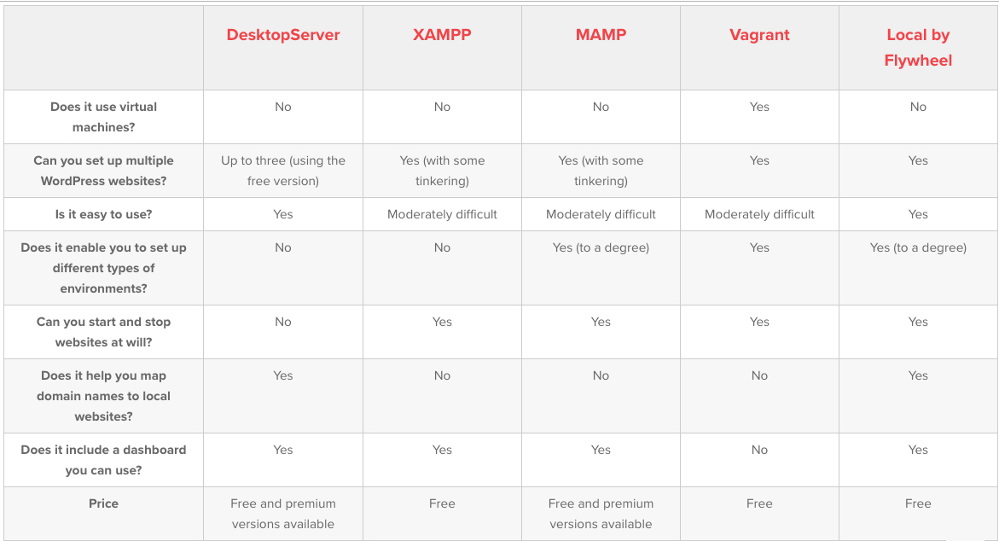
*Copyright © CodeinWP*

Source: <a href="https://www.codeinwp.com/blog/local-wordpress-development-tools/" target="_blank">5 of the Best Local WordPress Development Tools Compared for 2019</a>
- 

**For my personal usage, I will go for MAMP.**

**For a more professional usage, I will go for Docker, that the main purpose of this article.**

<h2>Install Docker</h2>

Here is a quick definition and some direct links to download the program for Windows or Mac.

**A small definition**

It's more what Docker produces than the definition that interests us!

> Docker is a computer program that performs operating-system-level virtualization.

> Docker is used to run software packages called containers. Containers are isolated from each other and bundle their own application, tools, libraries and configuration files; they can communicate with each other through well-defined channels.

<a href="https://www.docker.com/" target="_blank">More informations on Docker</a>


**Some direct links for installation**

Pick-up your Docker version and just follow the install it. It is very intuitive.

- <a href="https://www.docker.com/get-started" target="_blank">A nice & short introduction to Docker: Docker for Developers</a>

- <a href="https://docs.docker.com/docker-for-windows/install/" target="_blank">For Windows: Get started with Docker for Windows</a>

- <a href="https://docs.docker.com/docker-for-mac/install/" target="_blank">For Mac: Install Docker Desktop for Mac</a>

<a id="using"></a>
## (B) Using Docker for WordPress <a href="#top">&#8593;</a>

Like I said using Docker for Local Development Environment is a good choice even thought it is not so easy to use. Docker has a gentle learning curve but maybe steep on some aspect especially when you think about customization.

To my point of view, sometime customizing Docker makefile for instance tends to lead to a more complex and error-prone process that will prevent you from explaining to your colleagues. Complexity often ruins simplicity.

**Preparing to launch WP in Docker can be shrunk to 3 little steps and everything gonna be alright :)**


**1. Go to the directory where you want to install your WP with Docker. In my example, my directory is called `[path-to-your-wp-install-wp-with-docker-directory]/test-install_wp_5`.**
**This is where you are going to create the required file for Docker.**

``` bash
cd /[path-to-your-wp-install-wp-with-docker-directory]/
mkdir test-install_wp_5
cd test-install_wp_5/
touch Makefile
touch docker-compose.yml
```

**2. The directory `test-install_wp_5` should now contain 2 files**

``` bash
test-install_wp_5/
|-- Makefile
|-- docker-compose.yml
```

**3. Copy and paste the following sources for each file.**


**3.1 The `Makefile`**

Here is the source for the `Makefile`. Some comments were added to detail each command.

``` makefile
# make start
# Description: Start the containers for WP
start:
  docker-compose up -d --build

# make stop
# Description: Only stop the containers for WP
stop:
  docker-compose stop

# make down
# Description: Stop the containers and remove them
down:
  docker-compose down

# make ps
# Description: give a list of the containers for the WP
ps:
  docker-compose ps

# make cli
# Description: launch a console for WP-CLI
cli:
  docker-compose run --rm cli bash

# make clean
# Description: clean up the directory by removing the WP files
clean: stop
  @echo "💥 Removing Wordpress..."
  @rm -rf site
  @echo "💥 Removing Docker containers..."
  docker-compose rm -f
```
**3.2 The `docker-compose.yml`**

Here is the source for the `docker-compose.yml`. Some comments were added to detail each command.

```yaml
version: '3.1'
services:

 #DATABASE
 #Description: Do not change db top anything if you want to easily connect with phpMyAdmin
 db:
   image: mysql:5.7
   restart: always
   environment:
    #This is the password for the MySQL user root
    MYSQL_ROOT_PASSWORD: zambia_root_password
    MYSQL_DATABASE: zambia_wordpress
    MYSQL_USER: zambia_wordpress
    MYSQL_PASSWORD: zambia_wordpress_password
   #Description: Feel free to uncomment the lines below to keep your database data on your computer.
   #volumes: 
   #  - ./db:/var/lib/mysql

 #CMS
 #Description: Launch the famous WP 5 min install via the browser at the URL: http://localhost:8080/
 wordpress:
   image: wordpress
   restart: always
   ports:
     - 8080:80
   depends_on:
         - db
   environment:
      WORDPRESS_VERSION: 5.1
      WORDPRESS_LOCALE: en_US
      WORDPRESS_DB_HOST: db
      WORDPRESS_DB_NAME: zambia_wordpress
      WORDPRESS_DB_USER: zambia_wordpress
      WORDPRESS_DB_PASSWORD: zambia_wordpress_password
   # Keep your data and access via the console
   volumes: 
     - ./site:/var/www/html/
 
 #CLI
 #Description: With make cli, define in the makefile, you access to a WP-CLI for your WP install and pass the tradcionnal commands such as: wp theme list, wp post list, wp post generate --count=100 and so on
 #To access to the console in bash for WP-CLI, run the command below in a second tab of the console
 # $ docker-compose run --rm cli bash
 cli:
      image: wordpress:cli
      user: xfs
      volumes:
        - ./site:/var/www/html
      working_dir: /var/www/html

 
 #PHPMYADMIN
 #Description: After the famous WP 5 min install, you can connect to the WP database via phpMyAdmin at http://localhost:22222/ with the root user or the one use of the WP install
 phpmyadmin:
      image: phpmyadmin/phpmyadmin
      ports:
          - "22222:80"
      depends_on:
          - db
```

<a id="launch"></a>
## (C) Launch the install of your WordPress with Docker <a href="#top">&#8593;</a>

**1. Ready to go?**

- **Be sure to be in the proper directory `[path-to-your-wp-install-wp-with-docker-directory]/test-install_wp_5`**
- **Ensure you that you are connected to the Web with a good connection because there is quite a lot to download.**
  
**Just make `ls -l` to ensure that the required files are here.**


**Type `make start` to launch the install.**


**Docker launches the MySQL install**
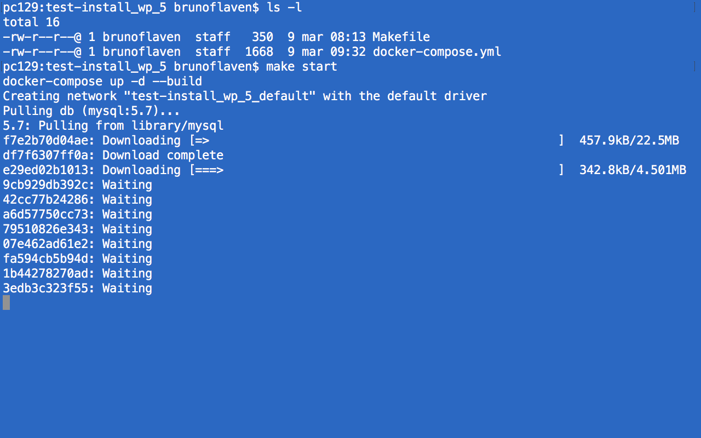

**Docker launches the WP install**
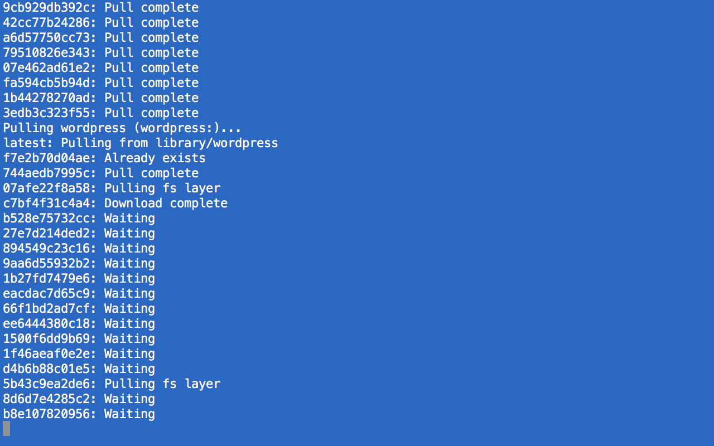

**Docker launches the phpMyAdmin install**
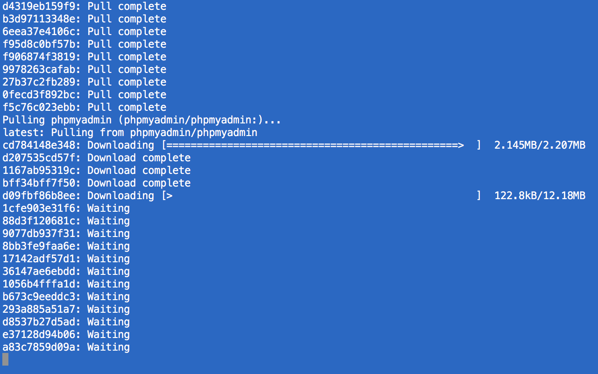

**Docker launches the WP-CLI install**
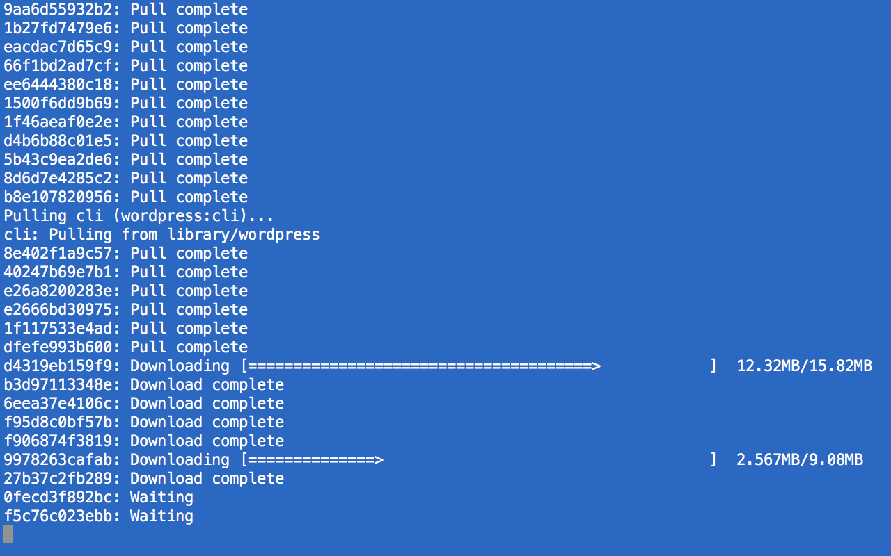

**Voilà, we are done! The installation is completed**
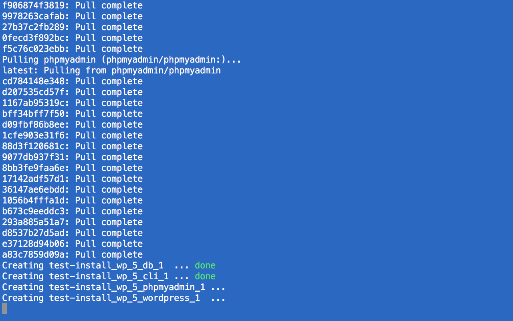

**The directory `test-install_wp_5` should now look like this. The WP files are in the directory `test-install_wp_5/site/`**

```bash
test-install_wp_5/
|-- Makefile
|-- docker-compose.yml
|-- site
	|-- _wp-admin
		|-- ...
	|-- _wp-content
		|-- ...
	|-- _wp-includes
		|-- ...
	|--index.php
	|--license.txt
	|--readme.html
	|--wp-activate.php
	|--wp-blog-header.php
	|--wp-comments-post.php
	|--wp-config-sample.php
	|--wp-config.php
	|--wp-cron.php
	|--wp-links-opml.php
	|--wp-load.php
	|--wp-login.php
	|--wp-mail.php
	|--wp-settings.php
	|--wp-signup.php
	|--wp-trackback.php
	|--xmlrpc.php
```

Docker has tremendous advantage to enable you to build and interact with virtual environments that match production as closely as possible or not. It is also possible to outsource some of the install complexity into the Dockerfile. This is what it was modestly done in our Dockerfile.


**2. Some additional commands for Docker**

Here is a set of useful commands for Docker. There at the end of this readme more additional and essential commands.

```bash
# clear the place
$ docker-compose stop
$ docker-compose down --remove-orphans
$ docker-compose build
$ docker-compose up -d

# show the running instances
$ docker-compose ps 
# show the info for a specific instance
$ docker inspect [name-of-the-instance]
# start a specific instance
$ docker start [name-of-the-container]

```

**3. Launch the installation via the browser.**

Just for educational purpose, we will finish the WP installation via the browser. **Before accessing to the Back-office, we will proceed to the WP install. It will send us back to the famous 5 min WordPress install. The 3 main URLs that we are going to use are the following:**

- Access to WP Front-office: `http://localhost:8080/`
- Access to WP Back-office: `http://localhost:8080/wp-admin/`
- Access to phpMyAdmin: `http://localhost:22222/`

**Be sure to have the containers up and running.**


**Go to the URL `http://localhost:8080/`, you should see the screen of the WP's five-min install**


**Fill the blanks with the proper informations. Set the credentials for back-office with simple credentials e.g. `admin:admin`**


**You are done :)**
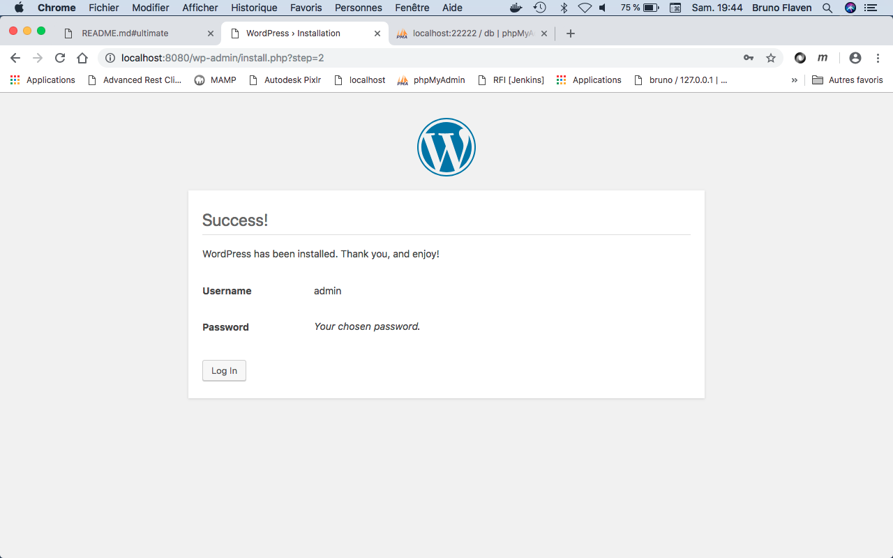

**Log in with `admin:admin`**


**Check the phpMyAdmin install with the user `root` from MySQL**


*Remember in the `docker-compose.yml`, we set the user `root` from MySQL with the following credentials `root:zambia_root_password`*
```yaml
db:
   image: mysql:5.7
   restart: always
   environment:
    MYSQL_ROOT_PASSWORD: zambia_root_password
    MYSQL_DATABASE: zambia_wordpress
    MYSQL_USER: zambia_wordpress
    MYSQL_PASSWORD: zambia_wordpress_password
   #Description: Feel free to uncomment the lines below to keep your database data on your computer.
   #volumes: 
   #  - ./db:/var/lib/mysql
```

**Enter in the phpMyAdmin with `root` from MySQL**


**As a root, you have access to everything including the WP database `zambia_wordpress`**


**Browsing the WP database `zambia_wordpress` show all the tables for WP**


<a id="working"></a>
## (D) Working with WP-CLI <a href="#top">&#8593;</a>

First of all, WP-CLI is a big thing almost like the WP REST API. The shortest definition that can be done is that with WP-CLI, you have an entire control on WP but without the traditional screens of the back-office, it is a UNIX-like environment. It is very geek oriented but it can be very useful.

WP-CLI includes many commands that allow you, the site administrator or developer, to install WordPress and take control on almost all features of the WP especially the trilogy: themes, plugins and content of the site.


**Be sure to be in the proper directory [path-to-your-wp-install-wp-with-docker-directory]/test-install_wp_5 before you launch the command `make cli` that will give you an access in bash inside the WP in Docker.**

**Enough for definition and warning, let's dive into the practice. Here is some commands for WP-CLI**


```bash
# manage themes
$ wp theme list
$ wp theme activate twentynineteen #already active
$ wp theme activate twentyseventeen #active twentyseventeen
$ wp theme search bootstrap #search for new theme with the chain bootstrap
$ wp theme install ultrabootstrap --activate #install and activate the theme ultrabootstrap

#manage plugin
$ wp plugin list #list the plugins
$ wp plugin search "clone" #search for plugin
$ wp plugin install duplicate-post --activate #install and activate Duplicate Post

#manage update
$ wp core update #update the fucking WP
$ wp core update-db #update the fucking DB
$ wp theme update --all #update the fucking themes
$ wp plugin update --all #update the fucking plugins

#manage content show the list of posts
$ wp post list

#generate 100 fake posts
$ wp post generate --count=100

#generate a fake post from a text file
$ wp post create ./_fake_content_files/lorem_fake_post.txt --post_title='2 Fake post example from a txt file' --post_status=publish
```

**Launch the `make cli` command**


**Launch the `ls -l` to ensure we are in bash inside the WP file-tree in Docker**


**Launch the `wp -info` to check the version of WP-CLI**


**Launch the `wp theme list` to check the themes and we do activate the theme twentyseventeen with `wp theme activate twentyseventeen`**


**Launch the `wp plugin list` to see the plugins**


**Launch the `wp post list` to see the posts inside the WP**
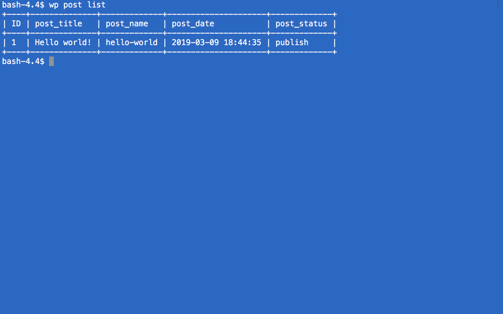

**Check the information in the back office if needed. There only one post in the WP, the hello world!**
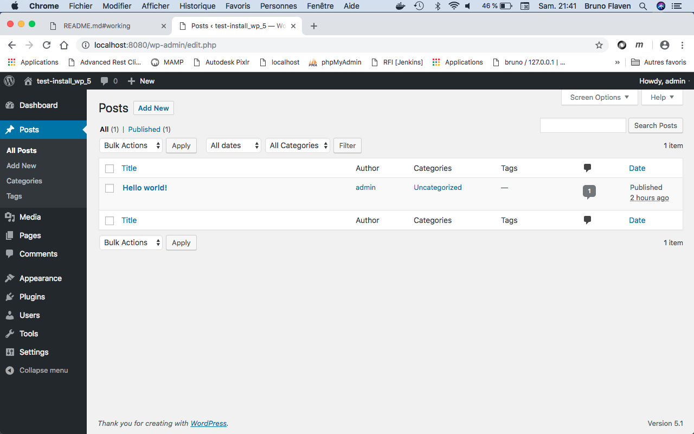

**Let's generate 100 fake posts with `wp post generate --count=100`inside the WP**


**Launch the `wp post list` show an increase in the post number**


**Check the information in the back office if needed.**
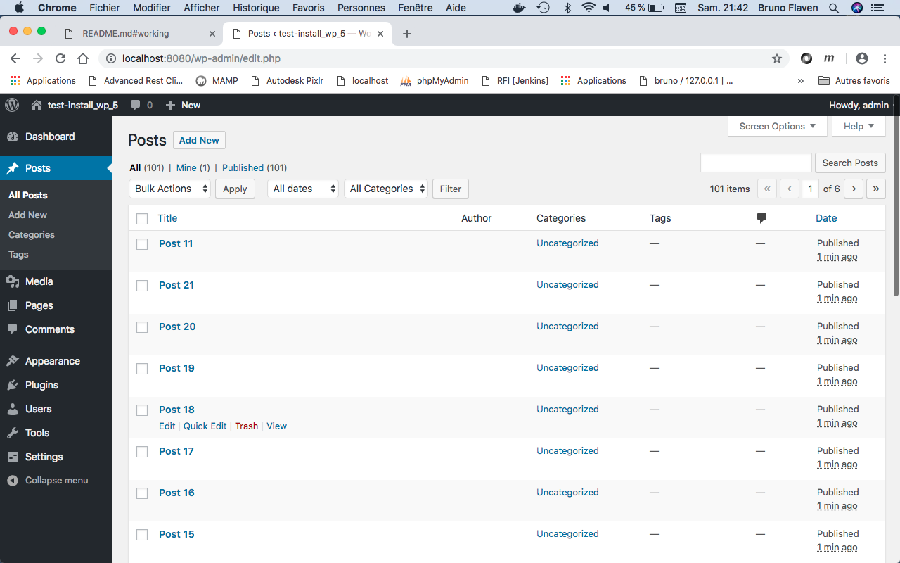

**Check the information in the front office if needed. As you can we have also a new theme!**
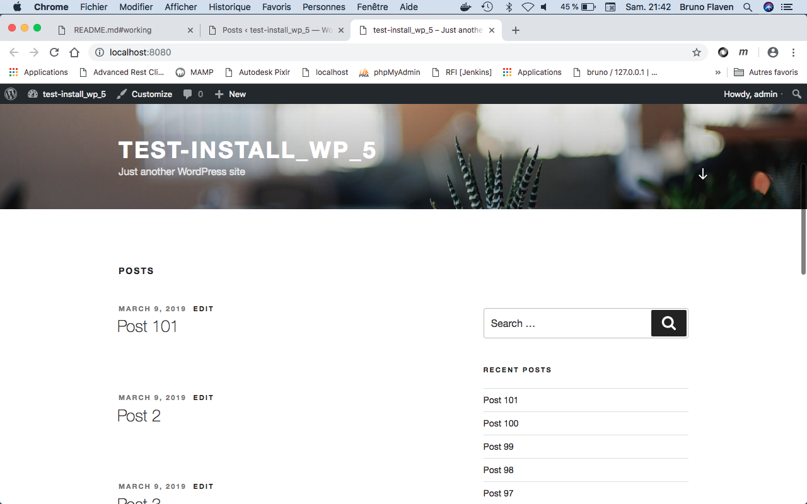

**Let's generate a fake post from a text file in `./_fake_content_files/lorem_fake_post.txt` inside the WP**


**Launch `wp post create ./_fake_content_files/lorem_fake_post.txt --post_title='2 Fake post example from a txt file' --post_status=publish` inside the WP. The post is created!**


**We can create this fake post from a text file as much as we want.**
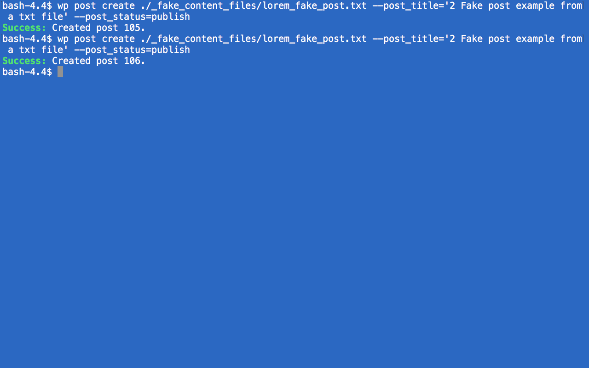


<a id="ultimate"></a>
## (E) The ultimate docker commands <a href="#top">&#8593;</a>

Here is a shortlist of Docker commands, powerful and useful. Caution with the last command!

```bash
#to access to wp-cli
$ docker-compose run --rm cli bash

#List all containers (only IDs) 
$ docker ps -aq

#Stop all running containers. 
$ docker stop $(docker ps -aq)

#Remove all containers. 
$ docker rm $(docker ps -aq)

#Remove all images. 
$ docker rmi $(docker images -q)

#Be careful! This will remove all images
$ docker rmi -f $(docker images -q)
```
<a id="more"></a>
## (F) More resources <a href="#top">&#8593;</a>


- Setting up WordPress with Docker<br><a href="https://cntnr.io/setting-up-wordpress-with-docker-262571249d50" target="_blank">https://cntnr.io/setting-up-wordpress-with-docker-262571249d50</a>


- EASY WORDPRESS MIGRATION WITH DOCKER<br><a href="https://joshmobley.net/writing/2017/04/09/easy-wordpress-migration-with-docker.html" target="_blank">https://joshmobley.net/writing/2017/04/09/easy-wordpress-migration-with-docker.html</a>

 
- Running Wordpress In Docker For The First Time<br><a href="https://vsupalov.com/docker-wordpress-start/" target="_blank">https://vsupalov.com/docker-wordpress-start/</a>


- DOCKER + WORDPRESS SETUP<br><a href="https://davidyeiser.com/tutorial/docker-wordpress-theme-setup" target="_blank">https://davidyeiser.com/tutorial/docker-wordpress-theme-setup</a>
 

- A Quick Guide to Local WordPress Development Using Docker<br><a href="https://themeisle.com/blog/local-wordpress-development-using-docker/" target="_blank">https://themeisle.com/blog/local-wordpress-development-using-docker/</a>

- Setup a local WordPress development environment with Docker<br><a href="https://visible.vc/engineering/docker-environment-for-wordpress/" target="_blank">https://visible.vc/engineering/docker-environment-for-wordpress/</a>


- Dockerize Local Bedrock & Sage Development with Lando<br><a href="https://roots.io/guides/dockerize-local-bedrock-and-sage-development-with-lando/" target="_blank">https://roots.io/guides/dockerize-local-bedrock-and-sage-development-with-lando/</a>

- Local WordPress Development with Docker and Docker Compose<br><a href="https://urre.me/writings/docker-for-local-wordpress-development/" target="_blank">https://urre.me/writings/docker-for-local-wordpress-development/</a>


- Set up WordPress with Docker... Fast!<br><a href="https://www.youtube.com/watch?v=pkp_Dr_4pOA" target="_blank">https://www.youtube.com/watch?v=pkp_Dr_4pOA</a>


- pantheon.io // Local Development<br><a href="https://pantheon.io/docs/local-development/" target="_blank">https://pantheon.io/docs/local-development/</a>

- Using Lando, Docker and Wordpress<br><a href="https://medium.com/@22acacia_cr/using-lando-docker-and-wordpress-bb5f236d98b7" target="_blank">https://medium.com/@22acacia_cr/using-lando-docker-and-wordpress-bb5f236d98b7</a>

- Create A WordPress Site With Lando<br><a href="https://joshpress.net/create-a-wordpres-site-with-lando/" target="_blank">https://joshpress.net/create-a-wordpres-site-with-lando/</a>


- A set of Docker containers for local Drupal development<br><a href="https://github.com/ten7/flight-deck" target="_blank">https://github.com/ten7/flight-deck</a>


- portainer.io // MAKING DOCKER MANAGEMENT EASY<br><a href="https://portainer.io" target="_blank">https://portainer.io</a>


- Lando Dev Docksal - Battle Royale of local development<br><a href="https://www.youtube.com/watch?v=SICvFbrikQE" target="_blank">https://www.youtube.com/watch?v=SICvFbrikQE</a>
 

- Using Bedrock and Sage for a better WordPress Workflow<br><a href="https://www.youtube.com/watch?v=MTeRGIc8WXE" target="_blank">https://www.youtube.com/watch?v=MTeRGIc8WXE</a>


- Local WordPress Development with Docker: 3 Easy Steps<br><a href="https://medium.com/@tatemz/local-wordpress-development-with-docker-3-easy-steps-a7c375366b9" target="_blank">https://medium.com/@tatemz/local-wordpress-development-with-docker-3-easy-steps-a7c375366b9</a>

- docs.docker.com // Quickstart: Compose and WordPress<br><a href="https://docs.docker.com/compose/wordpress/" target="_blank">https://docs.docker.com/compose/wordpress/</a>

- Wordpress the right way (part 1): setup<br><a href="http://blog.michaelperrin.fr/2018/10/26/automate-wordpress-part-1/" target="_blank">http://blog.michaelperrin.fr/2018/10/26/automate-wordpress-part-1/</a>


