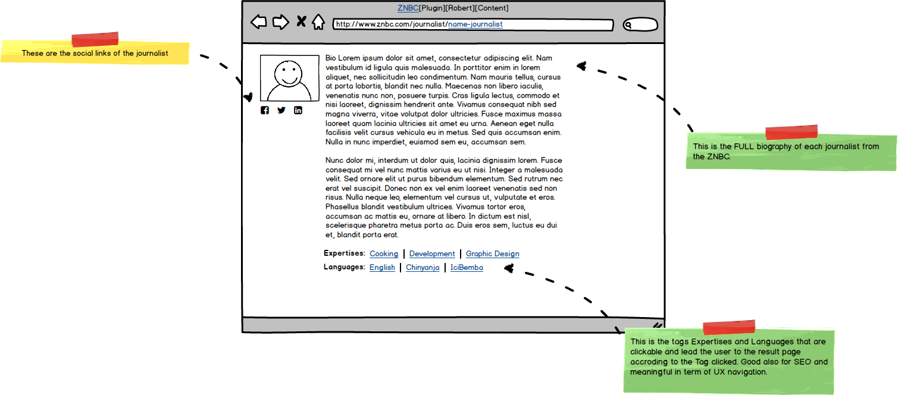

## ZNBC workshop plugins April 2019 Lusaka
Contributors: ZNBC feature team 
Plugin Name: znbc_robert_plugin_for_bio_1_2
Plugin URI: https://www.znbc.com
Version: 1.2
Author:ZNBC
Author URI: https://znbc.com
Link: https://www.znbc.co.zm
Tags: API, post_type, custom field, journalist profile
Requires at least: 4.4 so you do not need to install REST API (Version 2)
Tested up to: 4.8
Stable tag: 1.0
License: GPLv2
Abstract: Admin to manage in worpress a extended journalist profile with expertises and languages

### Description
It is a POC to manage post_type journalist and json to provide content to an application via WP and also a dedicated destion on the coming website znbc.co.zm

For this plugin znbc_robert_plugin_for_bio plugin made ZNBC team. Workshop to improve the author page + new taxonmy named Languages and extension of my edition capabilities for the journalist post_type

### Screenshots
See the github repo, check the directory znbc_robert_plugin_for_bio_screens_wireframing on github
znbc_listing_journalists_1.png
znbc_single_journalists_1.png

**Screen 1 Wireframe znbc listing all journalists** 
 
*<code>Copyright &copy; ZNBC</code>*

**Screen 2 Wireframe znbc view single journalists** 
 
*<code>Copyright &copy; ZNBC</code>*

